## 1目录（部分）

[EXT2与dax](#EXT2与dax)

[Linux中出现结构体的解释](#结构体解释)

[名词解释](#名词解释)

[F2FS袁学长笔记](https://github.com/RiweiPan/F2FS-NOTES)

[数据温度](#数据温度)

[NAT表](#NAT表)

[SIT表](#SIT表)

[NAT/SIT缓存及刷回](#NAT/SIT缓存及刷回)

​	[NAT与SIT原本和副本分布情况，以及**version bitmap**管理方式](#1.NAT与SIT原本和副本分布情况，以及**version bitmap**管理方式)

​	[NAT缓存机制](#2.NAT缓存机制)

​	[ NAT刷回机制](# 3.NAT刷回机制)

​	[SIT缓存机制](#4.SIT缓存机制)

​	[SIT刷回机制](#5.SIT刷回机制)

​	[node manager](#node manager)

​	[segment manager](#segment manager)

[SSA](#SSA)

[checkpoint机制](#checkpoint机制)

​	[checkpoint相关内存管理结构](#checkpoint相关内存管理结构)

​	[checkpoint的磁盘布局](#checkpoint的磁盘布局)

​	[获取f2fs_checkpoint](#获取f2fs_checkpoint)

​	[写入checkpoint](#写入checkpoint)

​	[compacted summaries和normal summaries区别](#compacted summaries和normal summaries区别)

​	[curseg](#curseg)

[涉及缓存page的函数](#涉及缓存page的函数)

[非第一次挂载，读取NVM超级块并设置nsbi](#非第一次挂载，读取NVM超级块并设置nsbi)

[F2FS的inode](#F2FS的inode)

[文件创建](#文件创建)

[文件读取](#文件读取)

[文件写入](#文件写入)

[一个free nid分配流程](#一个free nid分配流程)

[f2fs写入node，并设置nat entry中的地址](#f2fs写入node，并设置nat entry中的地址)

[f2fs如何切换curseg](#f2fs如何切换curseg)

[radix_tree使用方法](#radix_tree使用方法)

[各种锁的用法](#各种锁的用法)


### find_or_create_pagemount_bdev

mount_bdev函数的主要逻辑就是这样的

blkdev_get_by_path根据设备名得到block_device结构

sget得到已经存在或者新分配的super_block结构

如果是已经存在的sb，就释放第一步得到的bdev结构

如果是新的sb，就调用文件系统个别实现的fill_super函数继续处理新的sb，并创建根inode, dentry

返回得到的s_root


### EXT2与dax


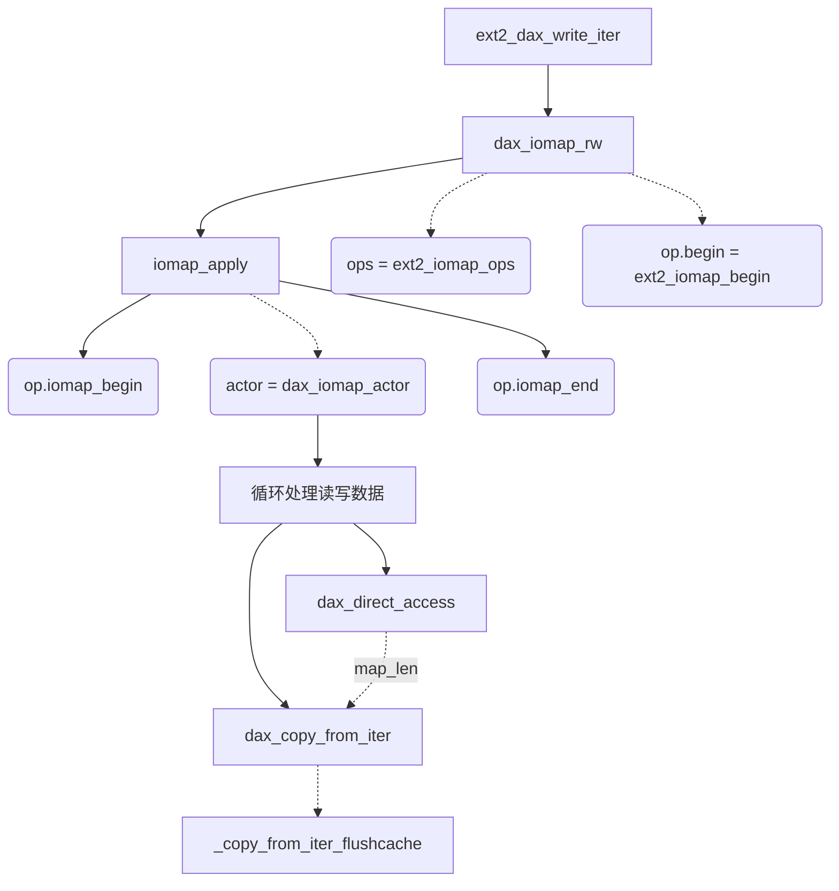

##### EXT2相关函数解释

1. ext2_get_blocks

   通过文件的逻辑地址找到数据的物理地址，并负责分配空间。原型如下，

   ```c
   int ext2_get_blocks(struct inode *inode,
   			   sector_t iblock, unsigned long maxblocks,
   			   u32 *bno, bool *new, bool *boundary,
   			   int create)
   /*
   	iblock表示文件的逻辑位置，位置以文件系统的块大小为单位，值为文件系统的以0为起始位置逻辑地址
   	maxblocks表示分配空间的最大块数
   	bno是返回的物理地址
   	该函数的返回值如果是正数，则表示分配了多少个块
   */
   ```

   

2. 

##### EXT2里的DAX函数

1. dax_iomap_rw：设置IOMAP的flag后调用iomap_apply

2. iomap_apply：似乎是不需要文件系统自己map page，分配page，和为每个page上锁。

3. op.iomap_begin：在iomap_apply之前，需要先对源数据（文件数据）上锁，保证之后进行map时不会失败。同时填写struct iomap的信息。我的理解是设备映射到内存中，需要填写相关映射信息，如每个映射页的映射类型和映射标志。而设置映射信息时又不会为每一个页单独设置信息，而是连续的映射块一起设置。如连续的文件页映射类型是iomap->type = IOMAP_MAPPED，映射标志是iomap->flags |=IOMAP_F_MERGED。

4. dax_direct_access：

   ```c
   /**
    * dax_direct_access() - translate a device pgoff to an absolute pfn
    * @dax_dev: a dax_device instance representing the logical memory range
    * @pgoff: offset in pages from the start of the device to translate
    * @nr_pages: number of consecutive pages caller can handle relative to @pfn
    * @kaddr: output parameter that returns a virtual address mapping of pfn
    * @pfn: output parameter that returns an absolute pfn translation of @pgoff
    *
    * Return: negative errno if an error occurs, otherwise the number of
    * pages accessible at the device relative @pgoff.
    */
   /*
   	@dax_dev:传入sbi->s_dax_dev
   	@pgoff:设备上物理页偏移
   	@nr_pages:要写入的连续页面
   	@kaddr:返回的虚拟地址，之后在这上面读写
   	@pfn:pgoff在物理设备上的绝对页号
   */
   long dax_direct_access(struct dax_device *dax_dev, pgoff_t pgoff, long nr_pages,
   		void **kaddr, pfn_t *pfn)
   ```

   

5. dax_iomap_actor ： dax处理读写的函数。函数里面一些参数

   ```c
   pos 	//文件写入偏移
   offset	//文件写入页内偏移
   sector	//写入对应扇区，大小为512B，
   pgoff	//上面扇区对应的物理页偏移    
       
   ```

   这个函数先是获取写入文件其实地址的对应物理地址所在页号，再使用dax_direct_access找到这个物理页号对应的内存地址vaddr，然后在vaddr基础上再加上页内偏移获得起始写入地址的映射内存地址，随后的dax_copy_from_iter或者dax_copy_to_iter都是在这个映射内存地址上操作的。之前的iomap_begin做的就是把文件逻辑地址和物理地址联系起来，方便在dax_iomap_actor中找到文件逻辑地址对应的物理地址，以及其内存映射地址。这个函数里面也是按字节复制数据的，而不是按块复制。

6. EXT2-DAX数据流

   ```mermaid
   graph TD
   A[iocb->ki_pos] --> B1[pos/offset]
   B1 				-->|页对齐| C1[iomap->offset]
   B2[pos/offset] 	--> C2[first_block]
   B3[length]		-->|length所占块数| C3[max_blocks]
   C2				--> D1[ext2_get_blocks]
   C3				-->	D1
   D1				-->|文件中偏移对应物理块的偏移| E1[bno]
   E1				-->|bno*块大小| F1[iomap->addr]
   B1				--> G1
   C1				-->	G1[pgoff]
   F1				--> G1
   A2[iocb->ki_filp->f_mapping->host]	--> B4[inode]
   ```

   

7. 


### DAX

#### DAX开发者给的建议

> 1. adding support to mark inodes as being DAX by setting the S_DAX flag in i_flags
> 2. implementing ->read_iter and ->write_iter operations which use dax_iomap_rw()
>        when inode has S_DAX flag set
> 3. implementing an mmap file operation for DAX files which sets the
>        VM_MIXEDMAP and VM_HUGEPAGE flags on the VMA, and setting the vm_ops to
>        include handlers for fault, pmd_fault, page_mkwrite, pfn_mkwrite. These
>        handlers should probably call dax_iomap_fault() passing the appropriate
>        fault size and iomap operations.（文件系统里好像没涉及到）
> 4. calling iomap_zero_range() passing appropriate iomap operations instead of
>        block_truncate_page() for DAX files
> 5. ensuring that there is sufficient locking between reads, writes,
>        truncates and page faults

#### DAX中不理解的地方

1. NOVA中，获取dax device是从 **sb->s_bdev->bd_disk->disk_name** 上得到的设备名，所以NVM被视为块设备？
2. 

### 结构体解释

1. **struct** dentry：VFS目录项结构体，super block中的s_root就是一个目录项，表示文件系统挂载的根在哪。

2. **struct** kiocb：一次IO的控制信息

    [深入理解linux内核中文第三版-P644](file:///E:/a_课程文件/毕设/预备知识/深入理解linux内核中文第三版(jb51.net).pdf) 

   ```c
   struct kiocb {
   	struct file		*ki_filp;	/* 文件结构体 */
   	loff_t			ki_pos;		/* 读写的开始位置 */
   	void (*ki_complete)(struct kiocb *iocb, long ret, long ret2);
   	void			*private;
   	int			ki_flags;
   	u16			ki_hint;
   	u16			ki_ioprio; /* See linux/ioprio.h */
   } __randomize_layout;
   ```

   

3. **struct** iov_iter：iovec迭代器

   >  read用于读取数据到一个用户态缓冲区，readv读取数据到多个用户态缓冲区，那么为了兼容这两种syscall，引入了数据结构iovec，而iov_iter又是对iovec的迭代。故使用iov_iter结构体的本质是用于协助处理用户态缓冲区数据和页缓存之间的映射关系。 
   >
   >  iovec的设计是为了处理从用户态传来的buffer数组（方便处理大数据），而iov_iter可以视为iovec的光标、指针。在进行读/写时，这个光标就会移动，即iov_iter结构体数据会改变。

   ```c
       struct iov_iter {
   	int type;	/* 迭代器类型，即读或写。还有一位bit表示是否为内核vector，即ITER_KVEC */
   				/* 如果是内核vector，则vec放在iter.kvec中；否则vec放在iter.iov中 */
       size_t iov_offset;	/* 在iovec数组中的偏移位置（单位：B） */
   	size_t count;		/* 整个iovec数组数据的字节数，即读写数据的比特数 */ 
       union {
   		const struct iovec *iov;	/* 第一个iovec的首地址 */
   		const struct kvec *kvec;
   		const struct bio_vec *bvec;
   		struct pipe_inode_info *pipe;
   	};
   	unsigned long nr_segs;	/* iovec的数量 */
       };
   ```

   [详见The iov_iter interface](https://lwn.net/Articles/625077/)

4. **struct** iovec

   ```c
   struct iovec
   {
   	void __user *iov_base;	/* buffer起始地址，注意这是用户进程的地址，在内核中不可以直接复制否侧会报错 */
   	__kernel_size_t iov_len; /* 读写长度 */
   }
   ```

   > **不能直接从iovec->iov_base复制数据**，访问用户传过来的iovec还需借助copy_from_user()。注意不能用copy_from_iter()，在实践中发现该函数会将iovec清空，导致后续的写操作没法完成。另外就是调用copy_from_user()之前还要check

5. **struct** iomap

   ```c
   struct iomap {
   	u64			addr; /* disk offset of mapping, bytes */
   	loff_t			offset;	/* file offset of mapping, bytes */
   	u64			length;	/* length of mapping, bytes */
   	u16			type;	/* type of mapping */
   	u16			flags;	/* flags for mapping */
   	struct block_device	*bdev;	/* block device for I/O */
   	struct dax_device	*dax_dev; /* dax_dev for dax operations */
   };
   ```

   

6. **struct** bio

   [深入理解Linux内核-P579](file:///E:/a_课程文件/毕设/预备知识/深入理解linux内核中文第三版(jb51.net).pdf)

   4.18.3版本里还有**struct** bvec_iter作为bio_vec的迭代器，

7. **struct** buffer_head

   [深入理解linux内核中文第三版-P623](file:///E:/a_课程文件/毕设/预备知识/深入理解linux内核中文第三版(jb51.net).pdf) 

8. **struct** address_space

   [深入理解linux内核中文第三版-P613](file:///E:/a_课程文件/毕设/预备知识/深入理解linux内核中文第三版(jb51.net).pdf) 

9. 

### 名词解释

1.  文件的洞（file hole）

   是普通文件的一部分，它是一些空字符但没有存放在磁盘的任何数据块中。洞是Unix文件一直存在的一个特点。 引人文件的洞是为了避免磁盘空间的浪费。它们因此被广泛地用在数据库应用中，更一般地说，用于在文件上进行散列的所有应用。  

2. discard(trim)功能

    	​	原本在**机械硬盘**上，写入数据时，系统会通知硬盘先将以前的擦除，再将新的数据写入到磁盘中。而在删除数据时，系统只会在此处做个标记，说明这里应该是没有东西了，等到真正要写入数据时再来真正删除，并且做标记这个动作会保留在磁盘缓存中，等到磁盘空闲时再执行。而当系统识别到SSD并确认**SSD支持Trim**后，在删除数据时，会不向硬盘通知删除指令，只使用Volume Bitmap来记住这里的数据已经删除。Volume Bitmap只是一个磁盘快照，其建立速度比直接读写硬盘去标记删除区域要快得多。这一步就已经省下一大笔时间了。然后再是写入数据的时候，由于NAND闪存保存数据是纯粹的数字形式，因此可以直接根据Volume Bitmap的情况，向快照中已删除的区块写入新的数据，而不用花时间去擦除原本的数据。 
   
3. prefree（预释放

     ​	f2fs的后台gc完成数据迁移之后，并不会把被清理的segment立即设置为free segment。因为后台gc只是把要迁移的page数据缓存起来，保留在后台等待回写，并没有真正地在硬盘中迁移。在下一个检查点到来之前都不能保证缓存的数据迁移完毕。如果完成后台gc后，立即向该segment写入数据，将会覆盖原来的数据。如果这时候在后台gc迁移数据未写完之前（或下一个检查点完成之前）出现宕机，则无法恢复到上一个检查点的状态（因为仅保存在内存中的迁移数据在硬盘中被覆盖了，在内存中的副本也丢失了）。仅当下一个检查点完成之后才能保证数据迁移完成，此时再将segment从prefree改成free状态。

4. SSR（分配block的方式

     ​	这是在LFS上改进的block分配方式。 直接向碎片化的Segment中的无效块写入数据是日志结构文件系统的另一个日志策略（Threaded Logging），又被称为SSR（Slack Space Recycling） 。该分配策略是用于应对前台写请求频繁而segment资源紧张的情况。传统LFS在遇到没有segment可写时，只能等待前台gc清空出一个segment。而SSR可以在之前的segment中找到无效的block来写入数据，从而不用等待前台gc。

5. 

## F2FS

#### 数据温度


​	写入十个文件后warm node占10个，hot node占1个，hot data占一个。warm data和cold data类型的分配段似乎在单独区域，这两个的起始seg_no都在万把以上。只有hot data和三个node的分配段段号是连续的。

[袁学长的笔记](https://github.com/RiweiPan/F2FS-NOTES)

#### 设备头结构体

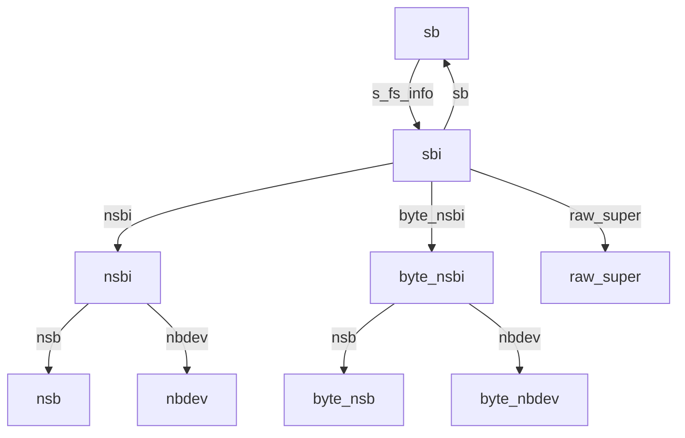

#### NAT表

[袁学长NAT笔记](https://github.com/RiweiPan/F2FS-NOTES/blob/master/F2FS-Layout/Node%20Address%20Table%E7%BB%93%E6%9E%84.md)


 	NAT区域由N个`struct f2fs_nat_block`组成，每一个`struct f2fs_nat_block`包含了455个`struct f2fs_nat_entry`。每一个nid对应了一个entry，每一个entry记录了这个node的在flash设备上的物理地址block_addr。同时entry也记录了一个ino的值，这个值用于找到这个node的parent node，如果nid=ino则表示这个node是inode，如果nid != ino，则表示这是一个direct_node或者indrect_node 。

​	每修改一个inode/direct_node/indrect_node，就要添加一项nat_entry，这个新的nat_entry可能在nat manager的cache里（nat_root），或curseg的journal里，或直接在nat区域。

```c
struct nat_entry_set {
	struct list_head set_list;	/* link with other nat sets */
	struct list_head entry_list;	/* link with dirty nat entries */
	nid_t set;			/* set number，集合号，即nat block的序号*/
	unsigned int entry_cnt;		/* the # of nat entries in set */
};
```

#### SIT表

[袁学长SIT笔记](https://github.com/RiweiPan/F2FS-NOTES/blob/master/F2FS-Layout/Segment%20Infomation%20Table%E7%BB%93%E6%9E%84.md)


​	Segment Infomation Table，简称SIT，是F2FS用于集中管理segment状态的结构。它的主要作用是维护的segment的分配信息，它的作用可以使用两个常见例子进行描述:

- 用户进行写操作，那么segment会根据用户写入的数据量分配特定数目的block给用户进行数据写入，SIT会将这些已经被分配的block标记为"已经使用(valid状态)"，那么之后的写操作就不会再使用这些block。
- 用户进行了**覆盖写**操作以后，由于F2FS**异地更新**的特性，F2FS会分配新block给用户写入，同时会将旧block置为"无效状态(invalid状态)"，这样GC的时候可以根据segment无效的block的数目，采取某种策略进行回收。

  综上所述，SIT的作用是维护每一个segment的block的使用状态以及有效无效状态。

```c
struct f2fs_sit_entry {
	__le16 vblocks;				/* reference above，该段有多少块被使用，注意：高位[15:10]表示该段被分配给哪种温度类型，即CURSEG_XXXX_TYPE；低位[9:0]才是有效块的数量 */
	__u8 valid_map[SIT_VBLOCK_MAP_SIZE];	/* bitmap for valid blocks，有效比特位 */
	__le64 mtime;				/* segment age for cleaning，该segment最新修改时间 */
} __packed;
```

​	关于初始化sit manager的流程，可以参考[segment manager](#segment manager)。

#### NAT/SIT缓存及刷回

[sit/nat_version_bitmap](https://blog.csdn.net/WaterWin/article/details/79901440)

##### 1.NAT与SIT原本和副本分布情况，以及**version bitmap**管理方式

​	f2fs为了防止宕机对元数据造成不可恢复的损害，所以sit/nat这种元数据有着两个副本，但是这两个副本只有一个是表示最新的数据，f2fs通过保存在cp pack中的sit/nat version bitmap来指示哪个才是最新的。 nat中每一块的副本存储在相邻segment，sit中每一块的副本存储在相邻block。

​	nm_i->nat_bitmap和sm_i->bitmap。

​	 下面是根据nid来获取该nid所对应的最新的f2fs_nat_entry所在的f2fs_nat_block所在的块地址。 

```c
static inline pgoff_t current_nat_addr(struct f2fs_sb_info *sbi, nid_t start)
{
	struct f2fs_nm_info *nm_i = NM_I(sbi);
	pgoff_t block_off;
	pgoff_t block_addr;

	/*
	 * block_off = segment_off * 512 + off_in_segment
	 * OLD = (segment_off * 512) * 2 + off_in_segment
	 * NEW = 2 * (segment_off * 512 + off_in_segment) - off_in_segment
	 */
	block_off = NAT_BLOCK_OFFSET(start);//ZN：先算出逻辑块偏移

	block_addr = (pgoff_t)(nm_i->nat_blkaddr +
		(block_off << 1) -	//ZN：注意NAT中segment副本成对出现，偏移要乘以2
		(block_off & (sbi->blocks_per_seg - 1)));//ZN：减去多乘的段内偏移

	if (f2fs_test_bit(block_off, nm_i->nat_bitmap))
		block_addr += sbi->blocks_per_seg;//ZN：如果在副本段上，则又要加上一个段的距离

	return block_addr;
}
```

​	根据上面的源码可以看出f2fs_nat_block是以下图的形式放置的。也就是f2fs_nat_entry为最小的单元，但是以f2fs_nat_block的组织形式组织成磁盘上最小的单位块，然后**相邻的这些f2fs_nat_block**形成一个segment，而相邻的这些f2fs_nat_block的**副本**也形成一个segment与其相邻放置。然后所有的这些segment以这样的方式重复。


​	下面是根据segno来获取该segment所对应的最新的f2fs_sit_entry所在的f2fs_sit_block所在的块地址。 

```c
static inline pgoff_t current_sit_addr(struct f2fs_sb_info *sbi, unsigned int start)
{
	struct sit_info *sit_i = SIT_I(sbi);
	unsigned int offset = SIT_BLOCK_OFFSET(start);
	block_t blk_addr = sit_i->sit_base_addr + offset;

	check_seg_range(sbi, start);

	if (f2fs_test_bit(offset, sit_i->sit_bitmap))
		blk_addr += sit_i->sit_blocks;

	return blk_addr;
}
```

​	根据上面的源码可以看出f2fs_sit_block是以下图的形式放置的。也就是f2fs_sit_entry为最小的单元，但是以f2fs_sit_block的组织形式组织成磁盘上最小的单位块，然后所有的f2fs_sit_block的第一个副本相邻放置，而这些f2fs_sit_block的第二个副本接着第一个副本的最后边。两个副本单独存放，不像NAT那样按segment交替放置。


​	接着是关于sit/nat version bitmap在cp pack中的放置情况，这个根据下面的函数可以看出。首先解释一下cp_payload这个字段，由于在f2fs的cp pack中的第一个块本来应该放置f2fs_checkpoint这个数据结构的，但是我们发现这个数据结构的大小不够一个block，也就是还有剩余的空间，所以当si/nat version bitmap比较大的时候，那么这两个bitmap是需要额外的空间来保存的，所以cp_payload记录的就是这个额外的空间的块的数量。

```c
static inline void *__bitmap_ptr(struct f2fs_sb_info *sbi, int flag)
{	//获取checkpoint中sit/nat的version_bitmap地址
    
	struct f2fs_checkpoint *ckpt = F2FS_CKPT(sbi);
	int offset;

	if (__cp_payload(sbi) > 0) {
        //如果bitmap需要额外的空间保存
		if (flag == NAT_BITMAP)
            //NAT_BITMAP的位置
			return &ckpt->sit_nat_version_bitmap;
		else
            //SIT_BITMAP在checkpoint的下一块
			return (unsigned char *)ckpt + F2FS_BLKSIZE;
	} else {
        //如果不需要额外空间
        //先放SIT_BITMAP，再放NAT_BITMAP
		offset = (flag == NAT_BITMAP) ?
			le32_to_cpu(ckpt->sit_ver_bitmap_bytesize) : 0;
		return &ckpt->sit_nat_version_bitmap + offset;
	}
}
```

​	根据源码分析一下：

​	当cp_payload > 0时，也就是存在额外的空间来存放bitmap。如果是NAT_BITMAP，那么nat version bitmap是放置在以f2fs_checkpoint的最后一个字段开始的长度为nat_ver_bitmap_bytesize的一段空间中，而对于SIT_BITMAP，sit version bitmap就是放置以cp pack第一个块后面的第二个块开始的长度为sit_ver_bitmap_bytesize的一段空间中。

​	当cp_payload = 0时，sit version bitmap是放置在以f2fs_checkpoint的最后一个字段开始的长度为sit_ver_bitmap_bytesize的一段空间中，nat version bitmap放置在紧跟sit version bitmap后面长度为nat_ver_bitmap_bytesize的一段空间中。

```c
struct f2fs_checkpoint {
	__le64 checkpoint_ver;
	__le64 user_block_count;
	__le64 valid_block_count;
	__le32 rsvd_segment_count;
	__le32 overprov_segment_count;
	__le32 free_segment_count;
	__le32 cur_node_segno[MAX_ACTIVE_NODE_LOGS];
	__le16 cur_node_blkoff[MAX_ACTIVE_NODE_LOGS];
	__le32 cur_data_segno[MAX_ACTIVE_DATA_LOGS];
	__le16 cur_data_blkoff[MAX_ACTIVE_DATA_LOGS];
	__le32 ckpt_flags;
	__le32 cp_pack_total_block_count;
	__le32 cp_pack_start_sum;
	__le32 valid_node_count;
	__le32 valid_inode_count;
	__le32 next_free_nid;
	__le32 sit_ver_bitmap_bytesize;
	__le32 nat_ver_bitmap_bytesize;
	__le32 checksum_offset;
	__le64 elapsed_time;
	unsigned char alloc_type[MAX_ACTIVE_LOGS];
	unsigned char sit_nat_version_bitmap[1];
} __packed;

```


##### 2.NAT缓存机制

​	nat的缓存机制是在f2fs_nm_info中有着**nat_root**管理这所有的缓存的nat_entry，nat_set_root管理所有的dirty的nat_entry。在每次读取nat的信息时(调用函数 get_node_info )，都是先查看node_info是否已经被缓存在nat_root或nat journal。如果都没有就通过get_meta_page获取相应的f2fs_nat_block，然后通过函数node_info_from_raw_nat将f2fs_nat_entry的信息转移到nat_entry上面，然后通过函数cache_nat_entry将nat_entry加入到nat_root，如果node_info修改了，那么就将其加入到nat_set_root。

​	

```c
struct node_info {
	nid_t nid;		/* node id */
	nid_t ino;		/* inode number of the node's owner */
	block_t	blk_addr;	/* block address of the node */
	unsigned char version;	/* version of the node */
	unsigned char flag;	/* for node information bits */
};
```

[另附1：博客——f2fs的journal机制](https://blog.csdn.net/sunwukong54/article/details/45669017)


```c
void f2fs_get_node_info(struct f2fs_sb_info *sbi, nid_t nid,
						struct node_info *ni)
{	//TODO：需要DAX改造
	struct f2fs_nm_info *nm_i = NM_I(sbi);
	struct curseg_info *curseg = CURSEG_I(sbi, CURSEG_HOT_DATA);//!ZN：似乎只能去当前使用段所含节点的node_info
	struct f2fs_journal *journal = curseg->journal;
	nid_t start_nid = START_NID(nid);
	struct f2fs_nat_block *nat_blk;
	struct page *page = NULL;
	struct f2fs_nat_entry ne;
    //SSD中的保存的是struct f2fs_nat_entry，struct nat_entry是内存结构。
	struct nat_entry *e;
	pgoff_t index;
	int i;

	ni->nid = nid;

	/* Check nat cache */
	down_read(&nm_i->nat_tree_lock);
	e = __lookup_nat_cache(nm_i, nid);
	if (e) {
		ni->ino = nat_get_ino(e);
		ni->blk_addr = nat_get_blkaddr(e);
		ni->version = nat_get_version(e);
		up_read(&nm_i->nat_tree_lock);
		return;
	}

	memset(&ne, 0, sizeof(struct f2fs_nat_entry));

	/* Check current segment summary */
	/* 
		ZN：在日志型结构的框架下，NAT和SIT两张表更新过于频繁会导致
		设备刷新过多，因此F2FS为NAT和SIT也设计了专门的journal结构
		暂时记录这些更新，并将journal保存所在段的对应SSA上。
	 */
	down_read(&curseg->journal_rwsem);
	/* ZN：去journal中查询是否有该nat entry，如果有则提取信息，并缓存nat entry */
	i = f2fs_lookup_journal_in_cursum(journal, NAT_JOURNAL, nid, 0);
	if (i >= 0) {
		ne = nat_in_journal(journal, i);
		node_info_from_raw_nat(ni, &ne);
	}
	up_read(&curseg->journal_rwsem);
	if (i >= 0) {
		up_read(&nm_i->nat_tree_lock);
		goto cache;
	}

	/* Fill node_info from nat page */
	/* ZN：如果journal里也找不到nat entry，则直接去原本nat区域查询 */
	index = current_nat_addr(sbi, nid);
	up_read(&nm_i->nat_tree_lock);

	page = f2fs_get_meta_page(sbi, index);
	nat_blk = (struct f2fs_nat_block *)page_address(page);
	ne = nat_blk->entries[nid - start_nid];
	node_info_from_raw_nat(ni, &ne);
	f2fs_put_page(page, 1);
cache:
	/* cache nat entry */
	cache_nat_entry(sbi, nid, &ne);
}
```

#####  3.NAT刷回机制

​	[另附2：博客——f2fs的checkpoint机制以及NAT、SIT的刷回过程详解](https://blog.csdn.net/u011649400/article/details/102491443)

​	NAT刷回流程如下，

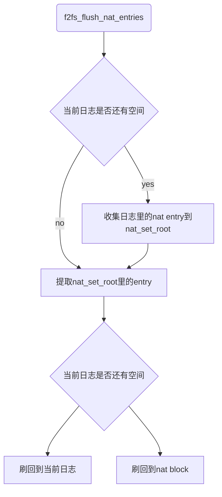

​	在刷回到nat block这一步时注意nat的副本机制，f2fs实际会调用`get_next_nat_page`，把最新数据复制到缓存中进行更新，然后把更新写入到副本中。

```c
void f2fs_flush_nat_entries(struct f2fs_sb_info *sbi, struct cp_control *cpc)
{
	struct f2fs_nm_info *nm_i = NM_I(sbi);
	struct curseg_info *curseg = CURSEG_I(sbi, CURSEG_HOT_DATA);
	struct f2fs_journal *journal = curseg->journal;
	struct nat_entry_set *setvec[SETVEC_SIZE];
	struct nat_entry_set *set, *tmp;
	unsigned int found;
	nid_t set_idx = 0;
	LIST_HEAD(sets);

	if (!nm_i->dirty_nat_cnt)
		return;

	down_write(&nm_i->nat_tree_lock);

	/*
	 * if there are no enough space in journal to store dirty nat
	 * entries, remove all entries from journal and merge them
	 * into nat entry set.
	 */
	/*
		ZN：如果curseg的journal剩余空间装不下nat_manager的nat_set_root中的
		所有nat entry，则先提取journal中的entry，并合并到nat_set_root中
	*/	
	if (enabled_nat_bits(sbi, cpc) ||
		!__has_cursum_space(journal, nm_i->dirty_nat_cnt, NAT_JOURNAL))
		remove_nats_in_journal(sbi);
   	/*
	 * __gang_lookup_nat_set 这个函数就是从radix tree读取set_idx开始，
	 * 连续读取SETVEC_SIZE这么多个nat_entry_set，保存在setvec中
	 * 然后按照一定条件（即按集合内entry数从小到大排列），通过__adju
	 * st_nat_entry_set函数加入到LIST_HEAD(sets)链表中
	 * */
	while ((found = __gang_lookup_nat_set(nm_i,
					set_idx, SETVEC_SIZE, setvec))) {
		unsigned idx;
		set_idx = setvec[found - 1]->set + 1;
		for (idx = 0; idx < found; idx++)
			__adjust_nat_entry_set(setvec[idx], &sets,
						MAX_NAT_JENTRIES(journal));
	}
	
	/* flush dirty nats in nat entry set */
    /* 遍历这个list所有的nat_entry_set，然后写入到curseg->journal中 */
	list_for_each_entry_safe(set, tmp, &sets, set_list)
		__flush_nat_entry_set(sbi, set, cpc);

	up_write(&nm_i->nat_tree_lock);
	/* Allow dirty nats by node block allocation in write_begin */
}
```

​	nat和sit的刷回操作都是以集合为单位进行刷回的。如nat的集合`struct nat_entry_set`是对一个f2fs_nat_block的内存抽象，用于保存修改后的nat entry，由nat manager的nat_set_root管理，一个set中所有nat entry同属于一个f2fs_nat_block。__flush_nat_entry_set则是逐个刷回所有集合

```c
static void __flush_nat_entry_set(struct f2fs_sb_info *sbi,
		struct nat_entry_set *set, struct cp_control *cpc)
{
	struct curseg_info *curseg = CURSEG_I(sbi, CURSEG_HOT_DATA);
	struct f2fs_journal *journal = curseg->journal;
	nid_t start_nid = set->set * NAT_ENTRY_PER_BLOCK;
	bool to_journal = true;
	struct f2fs_nat_block *nat_blk;
	struct nat_entry *ne, *cur;
	struct page *page = NULL;

	/*
	 * there are two steps to flush nat entries:
	 * #1, flush nat entries to journal in current hot data summary block.
	 * #2, flush nat entries to nat page.
	 */
    /* cursum journal 有空间就放进journal中，没有空间就放进nat 区域 */
	if (enabled_nat_bits(sbi, cpc) ||
		!__has_cursum_space(journal, set->entry_cnt, NAT_JOURNAL))
		to_journal = false;

	if (to_journal) {
		down_write(&curseg->journal_rwsem);
	} else {
        /* 每次刷写nat set的时候，都会 */
		page = get_next_nat_page(sbi, start_nid);
		nat_blk = page_address(page);
		f2fs_bug_on(sbi, !nat_blk);
	}

	/* flush dirty nats in nat entry set */
	list_for_each_entry_safe(ne, cur, &set->entry_list, list) {
		struct f2fs_nat_entry *raw_ne;
		nid_t nid = nat_get_nid(ne);
		int offset;

		f2fs_bug_on(sbi, nat_get_blkaddr(ne) == NEW_ADDR);

		if (to_journal) {
			offset = f2fs_lookup_journal_in_cursum(journal,
							NAT_JOURNAL, nid, 1);
			f2fs_bug_on(sbi, offset < 0);
			raw_ne = &nat_in_journal(journal, offset);
			nid_in_journal(journal, offset) = cpu_to_le32(nid);
		} else {
			raw_ne = &nat_blk->entries[nid - start_nid];
		}
		raw_nat_from_node_info(raw_ne, &ne->ni);
		nat_reset_flag(ne);
		__clear_nat_cache_dirty(NM_I(sbi), set, ne);
		if (nat_get_blkaddr(ne) == NULL_ADDR) {
			add_free_nid(sbi, nid, false, true);
		} else {
			spin_lock(&NM_I(sbi)->nid_list_lock);
			update_free_nid_bitmap(sbi, nid, false, false);
			spin_unlock(&NM_I(sbi)->nid_list_lock);
		}
	}

	if (to_journal) {
		up_write(&curseg->journal_rwsem);
	} else {
		__update_nat_bits(sbi, start_nid, page);
		f2fs_put_page(page, 1);
	}

	/* Allow dirty nats by node block allocation in write_begin */
	if (!set->entry_cnt) {
		radix_tree_delete(&NM_I(sbi)->nat_set_root, set->set);
		kmem_cache_free(nat_entry_set_slab, set);
	}
}
```

##### 4.SIT缓存机制

​	详见[segment manager](#segment manager)，sit manager中主要有四个结构体信息，**struct** sit_info，**struct** free_segmap_info，**struct** dirty_seglist_info，**struct** curseg_info。

##### 5.SIT刷回机制

​	

```c
void f2fs_flush_sit_entries(struct f2fs_sb_info *sbi, struct cp_control *cpc)
{
	struct sit_info *sit_i = SIT_I(sbi);
	unsigned long *bitmap = sit_i->dirty_sentries_bitmap;
	struct curseg_info *curseg = CURSEG_I(sbi, CURSEG_COLD_DATA);
	struct f2fs_journal *journal = curseg->journal;
	struct sit_entry_set *ses, *tmp;
	struct list_head *head = &SM_I(sbi)->sit_entry_set;
	bool to_journal = true;
	struct seg_entry *se;

	down_write(&sit_i->sentry_lock);

	if (!sit_i->dirty_sentries)
		goto out;

	/*
	 * add and account sit entries of dirty bitmap in sit entry
	 * set temporarily
	 *
	 * 遍历所有dirty的segment的segno，
	 * 找到对应的sit_entry_set，然后保存到sbi->sm_info->sit_entry_set
	 */
	add_sits_in_set(sbi);

	/*
	 * if there are no enough space in journal to store dirty sit
	 * entries, remove all entries from journal and add and account
	 * them in sit entry set.
	 */
	if (!__has_cursum_space(journal, sit_i->dirty_sentries, SIT_JOURNAL))
		remove_sits_in_journal(sbi);

	/*
	 * there are two steps to flush sit entries:
	 * #1, flush sit entries to journal in current cold data summary block.
	 * #2, flush sit entries to sit page.
	 * 遍历list中的所有segno对应的sit_entry_set
	 */
	list_for_each_entry_safe(ses, tmp, head, set_list) {
		struct page *page = NULL;
		struct f2fs_sit_block *raw_sit = NULL;
		unsigned int start_segno = ses->start_segno;
		unsigned int end = min(start_segno + SIT_ENTRY_PER_BLOCK,
						(unsigned long)MAIN_SEGS(sbi));
		unsigned int segno = start_segno; /* 找到 */

		if (to_journal &&
			!__has_cursum_space(journal, ses->entry_cnt, SIT_JOURNAL))
			to_journal = false;

		if (to_journal) {
			down_write(&curseg->journal_rwsem);
		} else {
			page = get_next_sit_page(sbi, start_segno); /* 访问磁盘，从磁盘获取到f2fs_sit_block */
			raw_sit = page_address(page); /* 根据segno获得f2fs_sit_block，然后下一步将数据写入这个block当中 */
		}

		/*
		 * flush dirty sit entries in region of current sit set
		 * 遍历segno~end所有dirty的seg_entry
		 * */
		for_each_set_bit_from(segno, bitmap, end) {
			int offset, sit_offset;

			se = get_seg_entry(sbi, segno); /* 根据segno从SIT缓存中获取到seg_entry，这个缓存是F2FS初始化的时候，将全部seg_entry读入创建的 */

			if (to_journal) {
				offset = f2fs_lookup_journal_in_cursum(journal,
							SIT_JOURNAL, segno, 1);
				f2fs_bug_on(sbi, offset < 0);
				segno_in_journal(journal, offset) =
							cpu_to_le32(segno);
				seg_info_to_raw_sit(se,
					&sit_in_journal(journal, offset)); // 更新journal的数据
				check_block_count(sbi, segno,
					&sit_in_journal(journal, offset));
			} else {
				sit_offset = SIT_ENTRY_OFFSET(sit_i, segno);
				seg_info_to_raw_sit(se,
						&raw_sit->entries[sit_offset]); // 更新f2fs_sit_block的数据
				check_block_count(sbi, segno,
						&raw_sit->entries[sit_offset]);
			}

			__clear_bit(segno, bitmap); // 从dirty map中除名
			sit_i->dirty_sentries--;
			ses->entry_cnt--;
		}

		if (to_journal)
			up_write(&curseg->journal_rwsem);
		else
			f2fs_put_page(page, 1);

		f2fs_bug_on(sbi, ses->entry_cnt);
		release_sit_entry_set(ses);
	}

	f2fs_bug_on(sbi, !list_empty(head));
	f2fs_bug_on(sbi, sit_i->dirty_sentries);
out:
	up_write(&sit_i->sentry_lock);

	/*
	 * 通过CP的时机，将暂存在dirty_segmap的dirty的segment信息，更新到free_segmap中
	 * 而且与接下来的do_checkpoint完成的f2fs_clear_prefree_segments有关系，因为 这里处理完了
	 * dirty prefree segments，所以在f2fs_clear_prefree_segments这个函数将它的dirty标记清除
	 * */
	set_prefree_as_free_segments(sbi);
}

static inline struct seg_entry *get_seg_entry(struct f2fs_sb_info *sbi,
						unsigned int segno)
{
	struct sit_info *sit_i = SIT_I(sbi);
	return &sit_i->sentries[segno];
}

static void set_prefree_as_free_segments(struct f2fs_sb_info *sbi)
{
	struct dirty_seglist_info *dirty_i = DIRTY_I(sbi);
	unsigned int segno;

	mutex_lock(&dirty_i->seglist_lock);
	/*
	 * 遍历dirty_seglist_info->dirty_segmap[PRE]，然后执行__set_test_and_free
	 * */
	for_each_set_bit(segno, dirty_i->dirty_segmap[PRE], MAIN_SEGS(sbi))
		__set_test_and_free(sbi, segno); /* 根据segno更新free_segmap的可用信息 */
	mutex_unlock(&dirty_i->seglist_lock);
}

static inline void __set_test_and_free(struct f2fs_sb_info *sbi,
		unsigned int segno)
{
	struct free_segmap_info *free_i = FREE_I(sbi);
	unsigned int secno = GET_SEC_FROM_SEG(sbi, segno);
	unsigned int start_segno = GET_SEG_FROM_SEC(sbi, secno);
	unsigned int next;

	spin_lock(&free_i->segmap_lock);
	/*
	 * free_i->free_segmap用这个bitmap表示这个segment是否是dirty
	 * 如果这个segno对应的segment位置等于0，代表不是dirty，不作处理
	 * 如果这个segno对应的位置等于1，表示这个segment是dirty的，那么在当前的free_segment+1，更新最新的free_segment信息
	 * */
	if (test_and_clear_bit(segno, free_i->free_segmap)) {
		free_i->free_segments++;

		next = find_next_bit(free_i->free_segmap,
				start_segno + sbi->segs_per_sec, start_segno);
		if (next >= start_segno + sbi->segs_per_sec) {
			if (test_and_clear_bit(secno, free_i->free_secmap))
				free_i->free_sections++;
		}
	}
	spin_unlock(&free_i->segmap_lock);
}


```


#### node manager

或nat manager，即初始化nat管理器结构体，结构体如下

```c
struct f2fs_nm_info {
	block_t nat_blkaddr;		/* base disk address of NAT */
	nid_t max_nid;			/* maximum possible node ids */
	nid_t available_nids;		/* # of available node ids */
	nid_t next_scan_nid;		/* the next nid to be scanned */
	unsigned int ram_thresh;	/* control the memory footprint */
	unsigned int ra_nid_pages;	/* # of nid pages to be readaheaded */
	unsigned int dirty_nats_ratio;	/* control dirty nats ratio threshold */

	/* NAT cache management */
	struct radix_tree_root nat_root;/* root of the nat entry cache */
	struct radix_tree_root nat_set_root;/* root of the nat set cache */
	struct rw_semaphore nat_tree_lock;	/* protect nat_tree_lock */
	struct list_head nat_entries;	/* cached nat entry list (clean) */
	unsigned int nat_cnt;		/* the # of cached nat entries */
	unsigned int dirty_nat_cnt;	/* total num of nat entries in set */
	unsigned int nat_blocks;	/* # of nat blocks */

	/* free node ids management */
	struct radix_tree_root free_nid_root;/* root of the free_nid cache */
	struct list_head free_nid_list;		/* list for free nids excluding preallocated nids */
    /* 缓存的空闲nid的数量，有两种类型，FREE_NID和PREALLOC_NID，nm_i->nid_cnt[FREE_NID]就是一般的nm_i->fcnt */
	unsigned int nid_cnt[MAX_NID_STATE];
	spinlock_t nid_list_lock;	/* protect nid lists ops */
	struct mutex build_lock;	/* lock for build free nids */
	unsigned char **free_nid_bitmap; /* 二维数组，显示所有nat block中nat entry的有效位 */
	unsigned char *nat_block_bitmap; /* 显示每一个nat block 是否包含有效nat entry */
	unsigned short *free_nid_count;	/* 显示每一个数显示对应nat block的可用nat entry数量 */

	/* for checkpoint */
	char *nat_bitmap;		/* 保存要存入检查点的nat version_bitmap */

	unsigned int nat_bits_blocks;	/* 检查点中 nat_bits 所占总块数，共2*nat_blocks + 8(两个32位crc校验码) */
	unsigned char *nat_bits;	/* NAT bits blocks */
    /*
    	检查点中nat_bits存放在在raw super上有效检查点所在段的末尾。结构如下，
    	8 blocks + full_nat_bits(size = nat_blocks) + empty_nat_bits(size = nat_blocks)
    */
	unsigned char *full_nat_bits;	/* full NAT pages，nat block里充满有效nat entry */
	unsigned char *empty_nat_bits;	/* empty NAT pages，nat block是空的 */
#ifdef CONFIG_F2FS_CHECK_FS
	char *nat_bitmap_mir;		/* NAT bitmap mirror */
#endif
	int bitmap_size;		/* bitmap size */
};
```


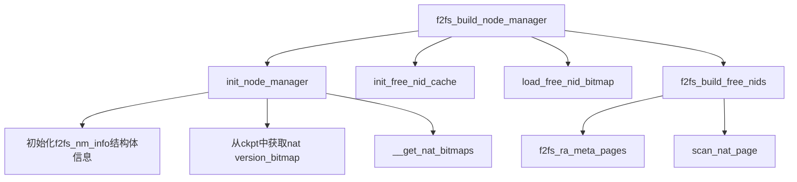

1. init_node_manager

   ```c
   static int init_node_manager(struct f2fs_sb_info *sbi)
   {
   	struct f2fs_super_block *sb_raw = F2FS_RAW_SUPER(sbi);
   	struct f2fs_nm_info *nm_i = NM_I(sbi);
   	unsigned char *version_bitmap;
   	unsigned int nat_segs, nat_blocks;
   
       /* NAT表在flash设备的起始物理地址 */
   	nm_i->nat_blkaddr = le32_to_cpu(sb_raw->nat_blkaddr);
   
   	/* segment_count_nat includes pair segment so divide to 2. */
   	nat_segs = le32_to_cpu(sb_raw->segment_count_nat) >> 1;
       
       /* NAT区域包含了多少个block，从nm_i->nat_blkaddr开始的nat_blocks就是NAT表的存储空间 */
   	nat_blocks = nat_segs << le32_to_cpu(sb_raw->log_blocks_per_seg);
   
       /* 最大的nid的值 */
   	nm_i->max_nid = NAT_ENTRY_PER_BLOCK * nat_blocks;
   
   	/* not used nids: 0, node, meta, (and root counted as valid node) */
   	nm_i->available_nids = nm_i->max_nid - F2FS_RESERVED_NODE_NUM;
   	nm_i->nid_cnt[FREE_NID] = 0;	/* nid_cnt 应该是缓存的nid的数量，有两种类型 */
   	nm_i->nid_cnt[PREALLOC_NID] = 0;
   	nm_i->nat_cnt = 0;
   	nm_i->ram_thresh = DEF_RAM_THRESHOLD;/* 用于控制结构体的内存使用上限，详见f2fs_available_free_memory */
       /* nat需要预读的块数，默认为0 */
   	nm_i->ra_nid_pages = DEF_RA_NID_PAGES;
   	nm_i->dirty_nats_ratio = DEF_DIRTY_NAT_RATIO_THRESHOLD;
   
       /* list + radix tree就是构建了类似 HashMap的索引结构，用于缓存free nid的entry */
   	INIT_RADIX_TREE(&nm_i->free_nid_root, GFP_ATOMIC);
   	INIT_LIST_HEAD(&nm_i->free_nid_list);
   	INIT_RADIX_TREE(&nm_i->nat_root, GFP_NOIO);
       //ZN：nat_set_root中存放的是nat_entry_set，每一片叶子代表一个集合
   	INIT_RADIX_TREE(&nm_i->nat_set_root, GFP_NOIO);
   	INIT_LIST_HEAD(&nm_i->nat_entries);
   
   	mutex_init(&nm_i->build_lock);
   	spin_lock_init(&nm_i->free_nid_list_lock);
   	init_rwsem(&nm_i->nat_tree_lock);
   
       /* 每次一次分配nid的时候，就会更新这个next_scan_nid的值，下次就可以从这里开始搜索 */
   	nm_i->next_scan_nid = le32_to_cpu(sbi->ckpt->next_free_nid);
   	nm_i->bitmap_size = __bitmap_size(sbi, NAT_BITMAP);
   	version_bitmap = __bitmap_ptr(sbi, NAT_BITMAP);
   	if (!version_bitmap)
   		return -EFAULT;
   	
   	nm_i->nat_bitmap = kmemdup(version_bitmap, nm_i->bitmap_size,
   					GFP_KERNEL);
   	if (!nm_i->nat_bitmap)
   		return -ENOMEM;
       
   	err = __get_nat_bitmaps(sbi);
   	if (err)
   		return err;
   	return 0;
   }
   ```

   ​	**nat_bitmap**就是检查点中的nat_version_bitmap，显示最新nat block在哪一个副本中。

   ​	[__get_nat_bitmaps](#NAT/SIT缓存及刷回) 用于为nat manager的nat_bits分配内存空间，并从checkpoint中加载nat_bits。checkpoint中nat_bits存放在raw super上有效检查点所在段的末尾。结构如下，

   ```c
   	8 blocks + full_nat_bits(size = nat_blocks) + empty_nat_bits(size = nat_blocks)
   ```

   其中，**full_nat_bits**显示nat block是否充满有效nat entry，**empty_nat_bits**显示nat block是否为空。可以参考函数__update_nat_bits()。

2. init_free_nid_cache

   ​	free_nid_cache实际是为nat manager的两个位图（free_nid_bitmap /nat_block_bitmap）和一个数组（free_nid_count）分配空间。

   ​	**free_nid_bitmap** 是一个二维数组，一共有nat blocks张位图，每张位图的位数为NAT_ENTRY_PER_BLOCK（一个block有1018个nat entry，这里再经过对齐处理），其中每一位显示一个nid在当前nat block上相应nat entry的空闲情况。注意：对于保存在日志中的free nid，**free_nid_bitmap**并不置1，因此只记录落盘的free

   ​	**nat_block_bitmap**是一维数组，一共有nat blocks位，每一位显示nat block是否有被文件系统扫描过上面的free nid。为1时表示该块已经被扫描过。

   ​	**free_nid_count**也是一维数组，共有nat blocks个数，每一个数显示对应nat block的可用nat entry数量。

3. load_free_nid_bitmap

   ​	似乎在**nat_block_bitmap**中把empty nat block 和 full nat block都置为1了，然后把empty nat block的所有的nid全标记空闲（**free_nid_bitmap**中置为1）。

4. f2fs_build_free_nids

   ​	先下一个将被扫描的nat block开始预读八个块，然后把**nat_block_bitmap**中没置为1的nat block都进行扫描。这么看确实full/empty的nat block并不需要逐条扫描。扫描调用scan_nat_page()。这个函数就是从nm_i->next_scan_nid开始逐条扫描。每遇到一条空闲的nat entry，就调用add_free_nid()添加nid到缓存。如果遇到有效nat entry就调用将**free_nid_bitmap** 对应位置置0，但注意这时候**free_nid_count**没有加上这个nat block中空闲的nid数量。
   
   ```c
   static void __f2fs_build_free_nids(struct f2fs_sb_info *sbi,
   						bool sync, bool mount)
   {
   	struct f2fs_nm_info *nm_i = NM_I(sbi);
   	int i = 0;
   	nid_t nid = nm_i->next_scan_nid;/* ZN：从sbi->ckpt->next_free_nid获得 */
   
   	if (unlikely(nid >= nm_i->max_nid))
   		nid = 0;
   
   	/* Enough entries */
   	if (nm_i->nid_cnt[FREE_NID] >= NAT_ENTRY_PER_BLOCK)
   		return;
   	/* 如果不需要同步，并且内存空间不足，则不再加入新的free_id */
   	if (!sync && !f2fs_available_free_memory(sbi, FREE_NIDS))
   		return;
   
   	if (!mount) {
   		/* try to find free nids in free_nid_bitmap */
   		/* 
   			在非挂载情况下，将扫描各个nat block的 free_nid_bitmap 
   			挂载时 free_nid_bitmap 还没构建完成
   		*/
   		scan_free_nid_bits(sbi);
   
   		if (nm_i->nid_cnt[FREE_NID] >= NAT_ENTRY_PER_BLOCK)
   			return;
   	}
   
   	/* readahead nat pages to be scanned */
   	/* ZN：预读8页nat block到meta mapping中 */
   	f2fs_ra_meta_pages(sbi, NAT_BLOCK_OFFSET(nid), FREE_NID_PAGES,
   							META_NAT, true);
   
   	down_read(&nm_i->nat_tree_lock);
   
   	while (1) {
   		if (!test_bit_le(NAT_BLOCK_OFFSET(nid),
   						nm_i->nat_block_bitmap)) {
   			struct page *page = get_current_nat_page(sbi, nid);
   			/* 扫描NAT page，添加free nid */
   			scan_nat_page(sbi, page, nid);
   			f2fs_put_page(page, 1);
   		}
   
   		nid += (NAT_ENTRY_PER_BLOCK - (nid % NAT_ENTRY_PER_BLOCK));/* 跳转到下一个nat block首个nid */
   		if (unlikely(nid >= nm_i->max_nid))
   			nid = 0;
   
   		if (++i >= FREE_NID_PAGES)
   			break;
   	}
   
   	/* go to the next free nat pages to find free nids abundantly */
   	/* 
   		扫描完毕，被扫描的free nid已经加入到缓存中，修改下一个将扫描的nid
   	 */
   	nm_i->next_scan_nid = nid;
   
   	/* find free nids from current sum_pages */
   	scan_curseg_cache(sbi);
   
   	up_read(&nm_i->nat_tree_lock);
   	/* 在重新预读一些NAT blok，但是默认预读0块*/
   	f2fs_ra_meta_pages(sbi, NAT_BLOCK_OFFSET(nm_i->next_scan_nid),
   					nm_i->ra_nid_pages, META_NAT, false);
   }
   ```
   
   

#### segment manager

​	即SIT 管理器，可以参考[SIT表](#SIT表)。**struct** f2fs_sm_info结构体如下，

```c
struct f2fs_sm_info {
	struct sit_info *sit_info;		/* whole segment information */
	struct free_segmap_info *free_info;	/* free segment information */
	struct dirty_seglist_info *dirty_info;	/* dirty segment information */
	struct curseg_info *curseg_array;	/* active segment information */

	struct rw_semaphore curseg_lock;	/* for preventing curseg change */

	block_t seg0_blkaddr;		/* block address of 0'th segment */
	block_t main_blkaddr;		/* start block address of main area */
	block_t ssa_blkaddr;		/* start block address of SSA area */

	unsigned int segment_count;	/* total # of segments */
	unsigned int main_segments;	/* # of segments in main area */
	unsigned int reserved_segments;	/* # of reserved segments */
	unsigned int ovp_segments;	/* # of overprovision segments */

	/* a threshold to reclaim prefree segments */
	unsigned int rec_prefree_segments;

	/* for batched trimming */
	unsigned int trim_sections;		/* # of sections to trim */

	struct list_head sit_entry_set;	/* sit entry set list */

	unsigned int ipu_policy;	/* in-place-update policy */
	unsigned int min_ipu_util;	/* in-place-update threshold */
	unsigned int min_fsync_blocks;	/* threshold for fsync */
	unsigned int min_hot_blocks;	/* threshold for hot block allocation */
	unsigned int min_ssr_sections;	/* threshold to trigger SSR allocation */

	/* for flush command control */
	struct flush_cmd_control *fcc_info;

	/* for discard command control */
	struct discard_cmd_control *dcc_info;
};
```

这里暂时不展示调用关系图了，直接看

```c
int f2fs_build_segment_manager(struct f2fs_sb_info *sbi)
{
	struct f2fs_super_block *raw_super = F2FS_RAW_SUPER(sbi);
	struct f2fs_checkpoint *ckpt = F2FS_CKPT(sbi);
	struct f2fs_sm_info *sm_info;
	int err;

	sm_info = f2fs_kzalloc(sbi, sizeof(struct f2fs_sm_info), GFP_KERNEL);
	if (!sm_info)
		return -ENOMEM;

	/* init sm info */
    /* 初始化一些地址信息，基础信息 */
	sbi->sm_info = sm_info;
	sm_info->seg0_blkaddr = le32_to_cpu(raw_super->segment0_blkaddr);
	sm_info->main_blkaddr = le32_to_cpu(raw_super->main_blkaddr);
	sm_info->segment_count = le32_to_cpu(raw_super->segment_count);
	sm_info->reserved_segments = le32_to_cpu(ckpt->rsvd_segment_count);
	sm_info->ovp_segments = le32_to_cpu(ckpt->overprov_segment_count);
	sm_info->main_segments = le32_to_cpu(raw_super->segment_count_main);
	sm_info->ssa_blkaddr = le32_to_cpu(raw_super->ssa_blkaddr);
	sm_info->rec_prefree_segments = sm_info->main_segments *
					DEF_RECLAIM_PREFREE_SEGMENTS / 100;
	if (sm_info->rec_prefree_segments > DEF_MAX_RECLAIM_PREFREE_SEGMENTS)
		sm_info->rec_prefree_segments = DEF_MAX_RECLAIM_PREFREE_SEGMENTS;

	if (!test_opt(sbi, LFS))
		sm_info->ipu_policy = 1 << F2FS_IPU_FSYNC;
	sm_info->min_ipu_util = DEF_MIN_IPU_UTIL;
	sm_info->min_fsync_blocks = DEF_MIN_FSYNC_BLOCKS;
	sm_info->min_hot_blocks = DEF_MIN_HOT_BLOCKS;
	sm_info->min_ssr_sections = reserved_sections(sbi);

	INIT_LIST_HEAD(&sm_info->sit_entry_set);

	init_rwsem(&sm_info->curseg_lock);

	if (!f2fs_readonly(sbi->sb)) {
		err = f2fs_create_flush_cmd_control(sbi);
		if (err)
			return err;
	}
	
	err = create_discard_cmd_control(sbi);
	if (err)
		return err;
	/* 初始化内存中的entry数据结构 */
	err = build_sit_info(sbi);
	if (err)
		return err;
    /* 初始化可用segment的数据结构 */
	err = build_free_segmap(sbi);
	if (err)
		return err;
    /* 恢复checkpoint active segment区域的信息，参考checkpoint结构那一节 */
	err = build_curseg(sbi);
	if (err)
		return err;

	/* reinit free segmap based on SIT */
    /* 从磁盘中将SIT物理区域记录的 物理区域sit_entry与只存在于内存的sit_entry建立联系 */
	err = build_sit_entries(sbi);
	if (err)
		return err;
	/* 根据checkpoint记录的恢复信息，恢复可用segment的映射关系 */
	init_free_segmap(sbi);
    /* 恢复脏segment的映射关系 */
	err = build_dirty_segmap(sbi);
	if (err)
		return err;

	init_min_max_mtime(sbi);
	return 0;
}
```

1. build_sit_info

   用于初始化**struct** sit_info，主要做的是在分配内存区域的entry、从checkpoint中调出位图**sit_bitmap**和初始化其他信息。

   ​	**sit_bitmap**是记录在检查点中的version bitmap。为0时有效 sit block在第一个副本，为1时在第二个副本。

   ​	**dirty_sentries_bitmap**记录segment是否为脏的bitmap,作用是当segment分配了一个block之后,这个segment对应的entry信息就会改变,因此将这个segment标记为脏。

   ​	**sentries**是保存内存sit entry的数组，大小长度与main area的segment的数目相同。

   ​	注意和nat entry一样，内存和硬盘的seg entry由不同的结构体管理。 内存中是**struct** seg_entry。硬盘上是**struct** f2fs_sit_entry。他们区别如下：

   ```c
   // 物理entry
   struct f2fs_sit_entry {
   	__le16 vblocks;				/* reference above */
   	__u8 valid_map[SIT_VBLOCK_MAP_SIZE];	/* bitmap for valid blocks */
   	__le64 mtime;				/* segment age for cleaning */
   } __packed;
   
   // 内存entry，比物理entry多了checkpoint所需的信息
   struct seg_entry {
   	unsigned int type:6;		/* 这个segment的类型 */
   	unsigned int valid_blocks:10;	/* 已经使用的块的数目 */
   	unsigned int ckpt_valid_blocks:10;	/* 上一次执行CP时，使用的块的数目 */
   	unsigned int padding:6;		/* padding */
   	unsigned char *cur_valid_map;	/* 通过bitmap(512位)表示这个segment哪些被使用，哪些没使用 */
   #ifdef CONFIG_F2FS_CHECK_FS
   	unsigned char *cur_valid_map_mir;	/* mirror of current valid bitmap */
   #endif
   	/*
   	 * # of valid blocks and the validity bitmap stored in the the last
   	 * checkpoint pack. This information is used by the SSR mode.
   	 */
   	unsigned char *ckpt_valid_map;	/* 上次CP时的bitmap状态 */
   	unsigned char *discard_map; /* 标记哪些block需要discard的bitmap */
   	unsigned long long mtime;	/* 修改时间 */
   };
   ```

    	物理entry也包含了segment type的信息，但是为了节省空间，将segment type于vblocks存放在了一起，及vblocks的前10位表示数目，后6位表示segment type，他们的关系可以用`f2fs_fs.h`找到: 

   ```c
   #define SIT_VBLOCKS_SHIFT	10
   #define SIT_VBLOCKS_MASK	((1 << SIT_VBLOCKS_SHIFT) - 1)
   #define GET_SIT_VBLOCKS(raw_sit)				\
   	(le16_to_cpu((raw_sit)->vblocks) & SIT_VBLOCKS_MASK)
   #define GET_SIT_TYPE(raw_sit)					\
   	((le16_to_cpu((raw_sit)->vblocks) & ~SIT_VBLOCKS_MASK)	\
   	 >> SIT_VBLOCKS_SHIFT)
   ```

    	因此，内存entry实际上仅仅多了2个与checkpoint相关的信息，即`ckpt_valid_blocks`与`ckpt_valid_map`。在系统执行checkpoint的时候，会将`valid_blocks`以及`cur_valid_map`的值分别写入`ckpt_valid_blocks`与`ckpt_valid_map`，当系统出现宕机的时候根据这个值恢复映射信息。 

2. build_free_segmap

    ​	用于初始化 **struct** free_segmap_info，主要记录MAIN区域中segment和section的空闲位图和空闲数量 。该函数分配了两个空闲位图的空间，这两个位图分别是**free_segmap**和**free_secmap**(实际上1 section = 1 segment，故位图大小一样，都是main区域的segment数量)。同时都初始化为脏数据。

    ```c
    struct free_segmap_info {
    	unsigned int start_segno;	/* start segment number logically */
    	unsigned int free_segments;	/* # of free segments */
    	unsigned int free_sections;	/* # of free sections */
    	spinlock_t segmap_lock;		/* free segmap lock */
    	unsigned long *free_segmap;	/* free segment bitmap，为0时表示free */
    	unsigned long *free_secmap;	/* free section bitmap，为0时表示free */
    };
    ```

    

3. build_curseg

   ​	current segment是当前系统正被分配的segment，该函数就是用于建立系统的node/data curseg。这个函数与checkpoint相关，属于后滚恢复的一部分。详细可见[袁学长笔记：Checkpoint内存管理结构](https://github.com/RiweiPan/F2FS-NOTES/blob/master/F2FS-Layout/Checkpoint%E7%BB%93%E6%9E%84.md)，或[curseg介绍](#curseg)

4. build_sit_entries

    ​	该函数用于加载所有sit entry到sit manager中。首先到SIT区域获取sit entry，然后再到cold data curseg的journal中获取sit entry（journal中的sit entry 更新鲜）。同时统计total_node_blocks，用于校验node block 的总数。

5. init_free_segmap

    根据checkpoint记录的恢复信息，恢复可用segment的映射关系，即初始化**struct** free_segmap_info。

6. build_dirty_segmap

    创建并恢复**struct** dirty_seglist_info，结构体如下，

    ```c
    struct dirty_seglist_info {
    	const struct victim_selection *v_ops;	/* victim selction operation */
    	unsigned long *dirty_segmap[NR_DIRTY_TYPE];/* 脏段位图，位数为main区域segment数量 */
    	struct mutex seglist_lock;		/* lock for segment bitmaps */
    	int nr_dirty[NR_DIRTY_TYPE];		/* # of dirty segments */
    	unsigned long *victim_secmap;		/* background GC victims */
    };
    /* NR_DIRTY_TYPE一共有八种类型的脏段数量，前六种针对不同数据段，最后两种相当于汇总 */
        enum dirty_type {
        	DIRTY_HOT_DATA,		/* dirty segments assigned as hot data logs */
        	DIRTY_WARM_DATA,	/* dirty segments assigned as warm data logs */
        	DIRTY_COLD_DATA,	/* dirty segments assigned as cold data logs */
        	DIRTY_HOT_NODE,		/* dirty segments assigned as hot node logs */
        	DIRTY_WARM_NODE,	/* dirty segments assigned as warm node logs */
        	DIRTY_COLD_NODE,	/* dirty segments assigned as cold node logs */
        	DIRTY,			/* to count # of dirty segments */
        	PRE,			/* to count # of entirely obsolete segments */
        	NR_DIRTY_TYPE
        };
    ```
    
    ​	注意，这里的**dirty_segmap**是脏段的位图，保存在sm_i->dirty_seglist_info，而在sm_i->sit_info中的**dirty_sentries_bitmap**则是sit entry的脏位图，注意区分。

#### SSA

 	SSA区域由N个`struct f2fs_summary_block`组成 ，其中包含512个f2fs_summary entries，一个journal区域以及一个footer区域。SSA只记录 （无论是data还是node）中每个block的父亲是谁，以及nat/sit日志。<a name="f2fs_summary_block"></a>

```c
/* 4KB-sized summary block structure */
struct f2fs_summary_block {
	struct f2fs_summary entries[ENTRIES_IN_SUM];
	struct f2fs_journal journal;
	struct summary_footer footer;
} __packed;
```

```c
/* a summary entry for a 4KB-sized block in a segment */
struct f2fs_summary {
	__le32 nid;		/* parent node id */
	union {
		__u8 reserved[3];
		struct {
			__u8 version;		/* node version number */
			__le16 ofs_in_node;	/* block index in parent node */
		} __packed;
	};
} __packed;
```

[更多关于curseg的信息](#curseg) 

### checkpoint机制

#### checkpoint相关内存管理结构

 Checkpoint的主要内存管理结构是**struct** f2fs_checkpoint，如下

```c
struct f2fs_checkpoint {
	__le64 checkpoint_ver;		/* CP版本，用于比较新旧版本进行恢复 */
	__le64 user_block_count;	/* # of user blocks */
	__le64 valid_block_count;	/* # of valid blocks in main area */
	__le32 rsvd_segment_count;	/* # of reserved segments for gc */
	__le32 overprov_segment_count;	/* # of overprovision segments */
	__le32 free_segment_count;	/* # of free segments in main area */

	/* information of current node segments */
	__le32 cur_node_segno[MAX_ACTIVE_NODE_LOGS];
	__le16 cur_node_blkoff[MAX_ACTIVE_NODE_LOGS];
	/* information of current data segments */
	__le32 cur_data_segno[MAX_ACTIVE_DATA_LOGS];
	__le16 cur_data_blkoff[MAX_ACTIVE_DATA_LOGS];
	__le32 ckpt_flags;		/* Flags : umount and journal_present */
	__le32 cp_pack_total_block_count;	/* total # of one cp pack */
	__le32 cp_pack_start_sum;	/* start block number of data summary */
	__le32 valid_node_count;	/* Total number of valid nodes */
	__le32 valid_inode_count;	/* Total number of valid inodes */
	__le32 next_free_nid;		/* Next free node number */
	__le32 sit_ver_bitmap_bytesize;	/* Default value 64 */
	__le32 nat_ver_bitmap_bytesize; /* Default value 256 */
	__le32 checksum_offset;		/* checksum offset inside cp block */
	__le64 elapsed_time;		/* mounted time */
	/* allocation type of current segment */
	unsigned char alloc_type[MAX_ACTIVE_LOGS];

	/* SIT and NAT version bitmap */
	unsigned char sit_nat_version_bitmap[1];
} __packed;
```

#### checkpoint的磁盘布局

​	下面是两种模式下的布局差异。


​	checkpoint在磁盘上布局如下，

```c
         +---------------------------------------------------------------------------+
         | f2fs_checkpoint | data summaries | hot node summaries | warm node summaries |
         | cold node summaries |
         +---------------------------------------------------------------------------+
                      
             				data summaries 两种布局如下
             .                 compacted summaries                 .        
             +----------------+-------------------+----------------+
             |  nat journal   |    sit journal    | data summaries |
             +----------------+-------------------+----------------+

             .                  normal summaries                   .        
             +----------------+-------------------+----------------+
             |                    data summaries                   |
             +----------------+-------------------+----------------+
```
 其中f2fs_checkpoint、hot/warm/cold node summaries都分别占用一个block的空间。f2fs为了减少Checkpoint的写入开销，将data summaries被设计为可变的。它包含两种写入方式，一种是compacted summaries写入，另一种是normal summaries写入。compacted summaries可以在一次Checkpoint中，减少1~2个page的写入。参考 [summary block](#f2fs_summary_block)结构。

#### 获取f2fs_checkpoint

 	hybrid f2fs挂载时是在NVM挂载完成之后才加载checkpoint的，其流程如下，

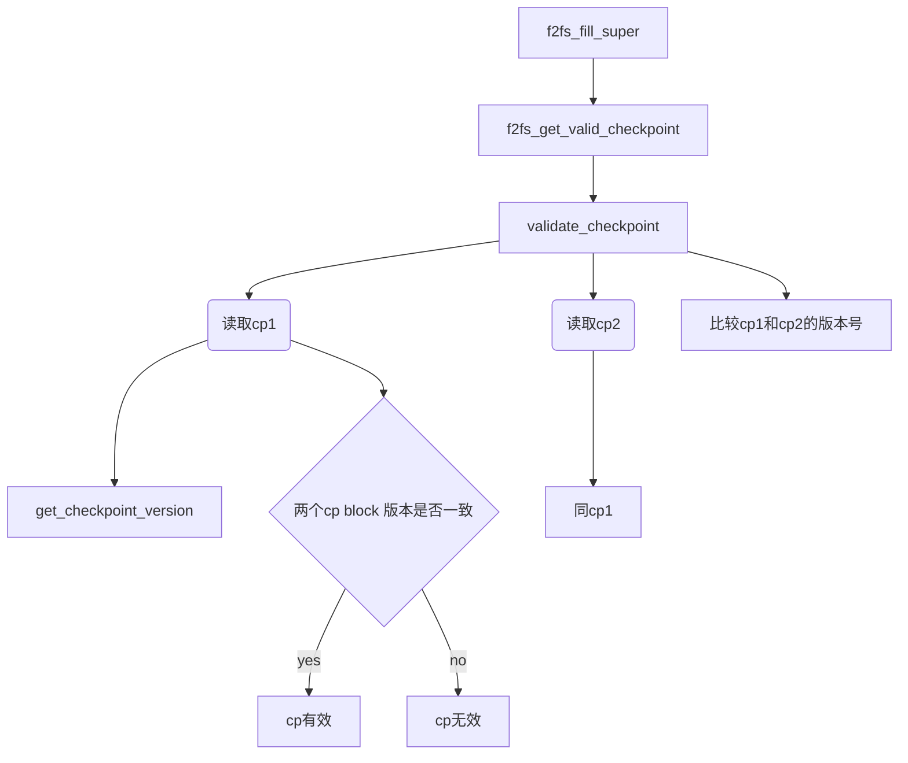

1. cp1与cp2

   ​	f2fs有两个checkpoint pack，分别是cp1和cp2。cp2保存在cp1的下一个segment中。f2fs则会选取其中有效的cp。如果都有效则选取版本号最新的cp。

2. f2fs_get_valid_checkpoint

   ​	关于checkpoint的元数据信息会保存在f2fs_checkpoint block，在读取checkpoint时，该块的原始信息会直接保存在	**struct** f2fs_checkpoint。一个cp pack里会有两个f2fs_checkpoint block，只有这两个f2fs_checkpoint block的版本号一致并且crc校验都成功时，才认为该cp pack是有效的。

   ​	这个函数首先分别读取两个cp pack，接着对比两个cp的版本，选择最新的cp复制到内存中（即sbi->ckpt）。

   ```c
   int f2fs_get_valid_checkpoint(struct f2fs_sb_info *sbi)
   {
   	struct f2fs_checkpoint *cp_block;
   	struct f2fs_super_block *fsb = sbi->raw_super;
   	struct page *cp1, *cp2, *cur_page;
   	unsigned long blk_size = sbi->blocksize;
   	unsigned long long cp1_version = 0, cp2_version = 0;
   	unsigned long long cp_start_blk_no;
   	unsigned int cp_blks = 1 + __cp_payload(sbi);
   	block_t cp_blk_no;
   	int i;
   	/* ZN begin */
   #ifndef F2FS_BYTE_NVM_ENABLE
   	sbi->ckpt = f2fs_kzalloc(sbi, array_size(blk_size, cp_blks),
   				 GFP_KERNEL);
   	if (!sbi->ckpt)
   		return -ENOMEM;
   	/* ZN end */
   #else
   	sbi->ckpt = (struct f2fs_checkpoint *)F2FS_DAX_ADDR(sbi);
   	if (!sbi->ckpt)
   		return -ENOMEM;
   #endif
   	/*
   	 * Finding out valid cp block involves read both
   	 * sets( cp pack1 and cp pack 2)
   	 */
   	cp_start_blk_no = le32_to_cpu(fsb->cp_blkaddr);
   	cp1 = validate_checkpoint(sbi, cp_start_blk_no, &cp1_version);
   
   	/* The second checkpoint pack should start at the next segment */
   	cp_start_blk_no += ((unsigned long long)1) <<
   				le32_to_cpu(fsb->log_blocks_per_seg);
   	cp2 = validate_checkpoint(sbi, cp_start_blk_no, &cp2_version);
   
   	if (cp1 && cp2) {
   		if (ver_after(cp2_version, cp1_version))
   			cur_page = cp2;
   		else
   			cur_page = cp1;
   	} else if (cp1) {
   		cur_page = cp1;
   	} else if (cp2) {
   		cur_page = cp2;
   	} else {
   		goto fail_no_cp;
   	}
   	/* ZN：这一步开始就完成checkpoint block到内存的移植了 */
   	cp_block = (struct f2fs_checkpoint *)page_address(cur_page);
   	memcpy(sbi->ckpt, cp_block, blk_size);
   
   	/* Sanity checking of checkpoint */
   	if (f2fs_sanity_check_ckpt(sbi))
   		goto free_fail_no_cp;
   
   	if (cur_page == cp1)
   		sbi->cur_cp_pack = 1;
   	else
   		sbi->cur_cp_pack = 2;
   
   	if (cp_blks <= 1)
   		goto done;
   
   	cp_blk_no = le32_to_cpu(fsb->cp_blkaddr);
   	if (cur_page == cp2)
   		cp_blk_no += 1 << le32_to_cpu(fsb->log_blocks_per_seg);
   	/* ZN：这一步便把checkpoint剩余部分给读入内存 */
   	for (i = 1; i < cp_blks; i++) {
   		void *sit_bitmap_ptr;
   		unsigned char *ckpt = (unsigned char *)sbi->ckpt;
   
   		cur_page = f2fs_get_meta_page(sbi, cp_blk_no + i);
   		sit_bitmap_ptr = page_address(cur_page);
   		memcpy(ckpt + i * blk_size, sit_bitmap_ptr, blk_size);
   		f2fs_put_page(cur_page, 1);
   	}
   done:
   	f2fs_put_page(cp1, 1);
   	f2fs_put_page(cp2, 1);
   	return 0;
   
   free_fail_no_cp:
   	f2fs_put_page(cp1, 1);
   	f2fs_put_page(cp2, 1);
   fail_no_cp:
   	kfree(sbi->ckpt);
   	return -EINVAL;
   }
   ```

   

3.  get_checkpoint_version

   ​	**struct** f2fs_checkpoint 保存在f2fs_checkpoint block上，通过get_checkpoint_version()函数从磁盘读取出来 。

   ```c
   static int get_checkpoint_version(struct f2fs_sb_info *sbi, block_t cp_addr,
   		struct f2fs_checkpoint **cp_block, struct page **cp_page,
   		unsigned long long *version)
   {
   	unsigned long blk_size = sbi->blocksize;
   	size_t crc_offset = 0;
   	__u32 crc = 0;
   
   	*cp_page = f2fs_get_meta_page(sbi, cp_addr); // 根据CP所在的地址cp_addr从磁盘读取一个block
   	*cp_block = (struct f2fs_checkpoint *)page_address(*cp_page); // 直接转换为数据结构
   
   	crc_offset = le32_to_cpu((*cp_block)->checksum_offset);
   	if (crc_offset > (blk_size - sizeof(__le32))) {
   		f2fs_msg(sbi->sb, KERN_WARNING,
   			"invalid crc_offset: %zu", crc_offset);
   		return -EINVAL;
   	}
   
   	crc = cur_cp_crc(*cp_block);
   	if (!f2fs_crc_valid(sbi, crc, *cp_block, crc_offset)) { // 比较CRC的值，进而知道是否成功读取出来
   		f2fs_msg(sbi->sb, KERN_WARNING, "invalid crc value");
   		return -EINVAL;
   	}
   
   	*version = cur_cp_version(*cp_block);
   	return 0;
   }
   ```

4. 

#### 写入checkpoint

 	参数中**struct** cp_control *cpc:是check point 控制结构体, 里面有对check point操作的参数，cp_reason值可以为CP_RECOVERY, CP_DISCARD, CP_TRIMMED, CP_SYNC, CP_UMOUNT等，表示在何种场景进行的check point操作。

```c
/*
 * We guarantee that this checkpoint procedure will not fail.
 */

int f2fs_write_checkpoint(struct f2fs_sb_info *sbi, struct cp_control *cpc)
{
	struct f2fs_checkpoint *ckpt = F2FS_CKPT(sbi);
	unsigned long long ckpt_ver;
	int err = 0;
    nvm_debug(NVM_DEBUG, ">>>>start f2fs_write_checkpoint");

	mutex_lock(&sbi->cp_mutex);
	/*
	如果checkpoint未dirty，但是有以下三种情况之一出现时直接退出，不做任何操作。
	1.cp_reason为cp_fastboot
	2.cp_reason为cp_sync
	3.cp_reason为cp_discard，但是discard blocks个数为0
	*/
	if (!is_sbi_flag_set(sbi, SBI_IS_DIRTY) &&
		((cpc->reason & CP_FASTBOOT) || (cpc->reason & CP_SYNC) ||
		((cpc->reason & CP_DISCARD) && !sbi->discard_blks)))
		goto out;
    /* 检查checkpoint是否有错误 */
	if (unlikely(f2fs_cp_error(sbi))) {
		err = -EIO;
		goto out;
	}
	if (f2fs_readonly(sbi->sb)) {
		err = -EROFS;
		goto out;
	}

	trace_f2fs_write_checkpoint(sbi->sb, cpc->reason, "start block_ops");
	/* ZN：block_operations函数作用是将所有将所有FS操作都冻结住 */
	err = block_operations(sbi);
	if (err)
		goto out;

	trace_f2fs_write_checkpoint(sbi->sb, cpc->reason, "finish block_ops");
	/* ZN：刷回合并的bio */
	f2fs_flush_merged_writes(sbi);

	/* this is the case of multiple fstrims without any changes */
	if (cpc->reason & CP_DISCARD) {
		if (!f2fs_exist_trim_candidates(sbi, cpc)) {
			unblock_operations(sbi);
			goto out;
		}

		if (NM_I(sbi)->dirty_nat_cnt == 0 &&
				SIT_I(sbi)->dirty_sentries == 0 &&
				prefree_segments(sbi) == 0) {
			f2fs_flush_sit_entries(sbi, cpc);
			f2fs_clear_prefree_segments(sbi, cpc);
			unblock_operations(sbi);
			goto out;
		}
	}

	/*
	 * update checkpoint pack index
	 * Increase the version number so that
	 * SIT entries and seg summaries are written at correct place
	 */
	ckpt_ver = cur_cp_version(ckpt);
	ckpt->checkpoint_ver = cpu_to_le64(++ckpt_ver);

	/* write cached NAT/SIT entries to NAT/SIT area */
	f2fs_flush_nat_entries(sbi, cpc);
	f2fs_flush_sit_entries(sbi, cpc);
	//COMPLETED:将MPT、NSB从cache拷贝到page
	/*start*/
	nvm_flush_mpt_pages(sbi,0);
	//TODO:先切换LFU的版本,再将LFU从cache拷贝到page
//	nvm_switch_lfu_version(ckpt);
//	nvm_flush_lfu_pages(sbi, le32_to_cpu(ckpt->ckpt_flags));
	//计数减半
//	nvm_half_lfu_count(sbi);
	//如果nsb是脏的，将nsb从cache拷贝到mapping
	if (sbi->nsbi->nvm_flag & NVM_NSB_DIRTY) {
		//获取nsb两个块中的有效块
		pgoff_t block_addr = NVM_SUPER_BLOCK;
		if (!is_set_ckpt_flags(sbi, CP_NSB_VER_FLAG)) {
			block_addr = NVM_SUPER_BLOCK + 1;
		}
		nvm_debug(NVM_DEBUG,"flush nsb,blkno:%d",block_addr);
		nvm_flush_nsb_pages(sbi,block_addr);
	}

	///test: 测试top-k max-heap的建立情况
	// f2fs_nvm_gc(sbi, true, true, NULL_SECNO);

	/*end*/

	/* unlock all the fs_lock[] in do_checkpoint() */
	err = do_checkpoint(sbi, cpc);
	if (err)
		f2fs_release_discard_addrs(sbi);
	else
		f2fs_clear_prefree_segments(sbi, cpc);

	//COMPLETED:cp完成之后拷贝NVM版本位图
	/*start*/
	nvm_set_ckpt_segment_map(sbi);
	/*end*/
	unblock_operations(sbi);
	stat_inc_cp_count(sbi->stat_info);

	if (cpc->reason & CP_RECOVERY)
		f2fs_msg(sbi->sb, KERN_NOTICE,
			"checkpoint: version = %llx", ckpt_ver);

	/* do checkpoint periodically */
	f2fs_update_time(sbi, CP_TIME);
	trace_f2fs_write_checkpoint(sbi->sb, cpc->reason, "finish checkpoint");
out:
	mutex_unlock(&sbi->cp_mutex);
    nvm_debug(NVM_DEBUG, "<<<<end f2fs_write_checkpoint");
	return err;
}
```

部分子函数分析如下，

1. block_operations

   ​	作用是等待所有正在FS操作全部完成，然后再冻结住，执行到最后，占据着两个锁, 一个是f2fs_lock_all锁，一个是node_write锁，其中f2fs_lock_all锁就是sbi->cp_rwsem。

   ​	为减少IO开销，f2fs会缓存不同类型的page。在block_operations会依次调用以下三个函数来缓存三种不同类型的page。

   1. f2fs_sync_dirty_inodes：写回所有缓存着的**dentry** inode的dirty  page，即 inode_type = **DIR_INODE**。

      ​	该函数会遍历dirty_list中的dentry inode，调用filemap_fdatawrite把每一个目录的inode->i_mapping里所有脏数据page写回硬盘。 该函数最终调用的函数是__filemap_fdatawrite_range，这个子函数找到位于偏移范围内的脏页面，并将页面写入磁盘相应位置处，其中WB_SYNC_ALL表示回写的模式，表示本次回写是文件完整性回写，不同于为了内存紧张时回收页面而进行的回写。

   2. f2fs_sync_inode_meta：写回**meta** inode的dirty page，即 inode_type = **DIRTY_META**。

      ​	这个meta inode管理着META区域。估计是在flush nat/sit entry之前，保证元数据区的稳定性。

   3.  f2fs_sync_node_pages：写回所有的dirty **node** pages。这些dirty node pages是由sbi->node_inode管理的。

2. f2fs_flush_merged_writes

   ​	f2fs为减少bio交互开销，会尽可能的将更多的page合并在一个bio中，再提交到设备 ，于是使用一个bio数组缓存回写的page。该数组保存在 **struct** f2fs_sb_info 中。

   ```c
   struct f2fs_sb_info {
   	...
   	struct f2fs_bio_info *write_io[NR_PAGE_TYPE]; // NR_PAGE_TYPE表示HOW/WARM/COLD不同类型的数据
   	...
   }
   
   ```

    	在Checkpoint流程中，必须要调用本函数来回写暂存的page，以获得系统最新的稳定状态信息。本函数调用三次 f2fs_submit_merged_write()，分别要回写DATA、NODE、META的信息。 具体调用流程如下

   ```mermaid
graph TD
   A[f2fs_flush_merged_writes]
   B[f2fs_submit_merged_write]
   C[__submit_merged_write_cond]
   D[__submit_merged_bio]
   E[__submit_bio]
   
   A	--> B
   B	--> C
   C	--> D
   D	--> E
   ```
   
   

3. f2fs_flush_nat_entries和f2fs_flush_sit_entries

   把缓存在内存的nat/sit entry分别写回到NAT和SIT，或journal中。详细分别见[ NAT刷回机制](# 3.NAT刷回机制)和[SIT缓存机制](#4.SIT缓存机制)

4. do_checkpoint

   ```c
   static int do_checkpoint(struct f2fs_sb_info *sbi, struct cp_control *cpc)
   {
   	struct f2fs_checkpoint *ckpt = F2FS_CKPT(sbi);
   	struct f2fs_nm_info *nm_i = NM_I(sbi);
   	unsigned long orphan_num = sbi->im[ORPHAN_INO].ino_num, flags;
   	block_t start_blk;
   	unsigned int data_sum_blocks, orphan_blocks;
   	__u32 crc32 = 0;
   	int i;
   	int cp_payload_blks = __cp_payload(sbi);
   	struct super_block *sb = sbi->sb;
   	struct curseg_info *seg_i = CURSEG_I(sbi, CURSEG_HOT_NODE);
   	u64 kbytes_written;
   	int err;
   
   	/* Flush all the NAT/SIT pages */
   	while (get_pages(sbi, F2FS_DIRTY_META)) {
   		f2fs_sync_meta_pages(sbi, META, LONG_MAX, FS_CP_META_IO);
   		if (unlikely(f2fs_cp_error(sbi)))
   			return -EIO;
   	}
   
   	/*
   	 * modify checkpoint
   	 * version number is already updated
   	 */
   	ckpt->elapsed_time = cpu_to_le64(get_mtime(sbi, true));
   	ckpt->free_segment_count = cpu_to_le32(free_segments(sbi));
   	for (i = 0; i < NR_CURSEG_NODE_TYPE; i++) {
   		ckpt->cur_node_segno[i] =
   			cpu_to_le32(curseg_segno(sbi, i + CURSEG_HOT_NODE));
   		ckpt->cur_node_blkoff[i] =
   			cpu_to_le16(curseg_blkoff(sbi, i + CURSEG_HOT_NODE));
   		ckpt->alloc_type[i + CURSEG_HOT_NODE] =
   				curseg_alloc_type(sbi, i + CURSEG_HOT_NODE);
   	}
   	for (i = 0; i < NR_CURSEG_DATA_TYPE; i++) {
   		ckpt->cur_data_segno[i] =
   			cpu_to_le32(curseg_segno(sbi, i + CURSEG_HOT_DATA));
   		ckpt->cur_data_blkoff[i] =
   			cpu_to_le16(curseg_blkoff(sbi, i + CURSEG_HOT_DATA));
   		ckpt->alloc_type[i + CURSEG_HOT_DATA] =
   				curseg_alloc_type(sbi, i + CURSEG_HOT_DATA);
   	}
   
   	/* 2 cp  + n data seg summary + orphan inode blocks */
   	data_sum_blocks = f2fs_npages_for_summary_flush(sbi, false);
   	spin_lock_irqsave(&sbi->cp_lock, flags);
   	if (data_sum_blocks < NR_CURSEG_DATA_TYPE)
   		__set_ckpt_flags(ckpt, CP_COMPACT_SUM_FLAG);
   	else
   		__clear_ckpt_flags(ckpt, CP_COMPACT_SUM_FLAG);
   	spin_unlock_irqrestore(&sbi->cp_lock, flags);
   
   	orphan_blocks = GET_ORPHAN_BLOCKS(orphan_num);
   	ckpt->cp_pack_start_sum = cpu_to_le32(1 + cp_payload_blks +
   			orphan_blocks);
   
   	if (__remain_node_summaries(cpc->reason))
   		ckpt->cp_pack_total_block_count = cpu_to_le32(F2FS_CP_PACKS+
   				cp_payload_blks + data_sum_blocks +
   				orphan_blocks + NR_CURSEG_NODE_TYPE);
   	else
   		ckpt->cp_pack_total_block_count = cpu_to_le32(F2FS_CP_PACKS +
   				cp_payload_blks + data_sum_blocks +
   				orphan_blocks);
   
   	/* update ckpt flag for checkpoint */
   	update_ckpt_flags(sbi, cpc);
   	//COMPLETED:在此切换nsb版本号：如果超级块为脏，切换版本号
   	/*start*/
   	if(sbi->nsbi->nvm_flag & NVM_NSB_DIRTY){
   		nvm_switch_nsb_version(ckpt);
   		//更新版本之后清除NVM_NSB_DIRTY标志
   		sbi->nsbi->nvm_flag ^= NVM_NSB_DIRTY;
   	}
   	/*end*/
   
   	/* update SIT/NAT bitmap */
   	get_sit_bitmap(sbi, __bitmap_ptr(sbi, SIT_BITMAP));
   	get_nat_bitmap(sbi, __bitmap_ptr(sbi, NAT_BITMAP));
   
   	crc32 = f2fs_crc32(sbi, ckpt, le32_to_cpu(ckpt->checksum_offset));
   	*((__le32 *)((unsigned char *)ckpt +
   				le32_to_cpu(ckpt->checksum_offset)))
   				= cpu_to_le32(crc32);
   
   	start_blk = __start_cp_next_addr(sbi);
   
   	/* write nat bits */
   	if (enabled_nat_bits(sbi, cpc)) {
   		__u64 cp_ver = cur_cp_version(ckpt);
   		block_t blk;
   
   		cp_ver |= ((__u64)crc32 << 32);
   		*(__le64 *)nm_i->nat_bits = cpu_to_le64(cp_ver);
   
   		blk = start_blk + sbi->blocks_per_seg - nm_i->nat_bits_blocks;
   		for (i = 0; i < nm_i->nat_bits_blocks; i++)
   			f2fs_update_meta_page(sbi, nm_i->nat_bits +
   					(i << F2FS_BLKSIZE_BITS), blk + i);
   
   		/* Flush all the NAT BITS pages */
   		while (get_pages(sbi, F2FS_DIRTY_META)) {
   			f2fs_sync_meta_pages(sbi, META, LONG_MAX,
   							FS_CP_META_IO);
   			if (unlikely(f2fs_cp_error(sbi)))
   				return -EIO;
   		}
   	}
   
   	/* write out checkpoint buffer at block 0 */
   	f2fs_update_meta_page(sbi, ckpt, start_blk++);
   
   	for (i = 1; i < 1 + cp_payload_blks; i++)
   		f2fs_update_meta_page(sbi, (char *)ckpt + i * F2FS_BLKSIZE,
   							start_blk++);
   
   	if (orphan_num) {
   		write_orphan_inodes(sbi, start_blk);
   		start_blk += orphan_blocks;
   	}
   
   	f2fs_write_data_summaries(sbi, start_blk);
   	start_blk += data_sum_blocks;
   
   	/* Record write statistics in the hot node summary */
   	kbytes_written = sbi->kbytes_written;
   	if (sb->s_bdev->bd_part)
   		kbytes_written += BD_PART_WRITTEN(sbi);
   
   	seg_i->journal->info.kbytes_written = cpu_to_le64(kbytes_written);
   
   	if (__remain_node_summaries(cpc->reason)) {
   		f2fs_write_node_summaries(sbi, start_blk);
   		start_blk += NR_CURSEG_NODE_TYPE;
   	}
   
   	/* update user_block_counts */
   	sbi->last_valid_block_count = sbi->total_valid_block_count;
   	percpu_counter_set(&sbi->alloc_valid_block_count, 0);
   
   	/* Here, we have one bio having CP pack except cp pack 2 page */
   	f2fs_sync_meta_pages(sbi, META, LONG_MAX, FS_CP_META_IO);
   
   	/* wait for previous submitted meta pages writeback */
   	wait_on_all_pages_writeback(sbi);
   
   	if (unlikely(f2fs_cp_error(sbi)))
   		return -EIO;
   
   	/* flush all device cache */
   	err = f2fs_flush_device_cache(sbi);
   	if (err)
   		return err;
   
   	/* barrier and flush checkpoint cp pack 2 page if it can */
   	commit_checkpoint(sbi, ckpt, start_blk);
   	wait_on_all_pages_writeback(sbi);
   
   	f2fs_release_ino_entry(sbi, false);
   
   	if (unlikely(f2fs_cp_error(sbi)))
   		return -EIO;
   
   	clear_sbi_flag(sbi, SBI_IS_DIRTY);
   	clear_sbi_flag(sbi, SBI_NEED_CP);
   	__set_cp_next_pack(sbi);
   
   	/*
   	 * redirty superblock if metadata like node page or inode cache is
   	 * updated during writing checkpoint.
   	 */
   	if (get_pages(sbi, F2FS_DIRTY_NODES) ||
   			get_pages(sbi, F2FS_DIRTY_IMETA))
   		set_sbi_flag(sbi, SBI_IS_DIRTY);
   
   	f2fs_bug_on(sbi, get_pages(sbi, F2FS_DIRTY_DENTS));
   
   	return 0;
   }
   ```

   

5. f2fs_npages_for_summary_flush（在上面的do_checkpoint中

   ​	根据三个data curseg有效块的数量来决定以compacted模式还是normal模式写入data summaries，计算需要写入多少curseg data summaries到checkpoint中，之后会根据计算的data_sum_blocks设置checkpoint的data summary 写回方式标志。

   ​	参考[compacted summaries和normal summaries区别](#compacted summaries和normal summaries区别)，不同类型的summary block的可以保存的summary的大小，可以得到HOT,WARM,COLD DATA这三种类型，如果目前**加起来**仅使用了 

   1. 少于439的block(只修改了439个f2fs_summary)，那么可以通过compacted回写方式进行回写，即通过一个compacted summary block完成回写，需要回写1个block。
   2. 大于439，少于439+584=1023个block，那么可以通过compacted回写方式进行回写，即可以通过compacted summary block加一个纯summary block的方式保存所有信息，需要回写2个block。
   3. 大于1023的情况下，即和normal summary block同样的回写情况，那么就会使用normal summary block的回写方式完成回写，即回写3个block。(因为大于1023情况下，如果继续使用compacted回写，最差的情况下要回写4个block)
      

6. 

#### compacted summaries和normal summaries区别

[袁学长笔记： compacted summaries和normal summaries的差别 ](https://github.com/RiweiPan/F2FS-NOTES/blob/master/F2FS-Data-Recovery/Checkpoint%E6%B5%81%E7%A8%8B.md)

​	通过查看curseg的结构可以知道，curseg管理了(NODE,DATA) X (HOT,WARM,COLD)总共6个的segment，因此也需要管理这6个segment对应的`f2fs_summary_block`。

​	因此一般情况下，每一次checkpoint时候，应该需要回写6种类型的`f2fs_summary_block`，即6个block到磁盘。为了减少这部分回写的开销，f2fs针对**DATA**类型`f2fs_summary_block`设计了一种compacted summary block。一般情况下，DATA需要回写3个`f2fs_summary_block`到磁盘(HOT,WARM,COLD)，但是如果使用了compacted summary block，大部分情况下只需要回写1~2个block。

​	compacted summary block  分别维护了一个公用的nat journal（挂载时会加载到在HOT DATA curseg的journal）和sit journal（挂载时会加载到 COLD DATA curseg 的journal）。并且将HOT,WARM,COLD三种类型的summary混合保存同一个data summaries数组中，它们的差别如下:

```c
compacted summary block (4KB)
+------------------+
|nat journal       |
|sit journal       |
|data sum[439]     | data summaries数组大小是439
+------------------+
|                  | 如果需要，会接上一个纯summary数组的block
| data sum[584]    | data summaries数组大小是584
|                  |
+------------------+


normal summary block，表示三种类型的DATA的summary
+--------------------+
|hot data journal    |
|hot data summaries  | data summaries数组大小是512
|                    |
+--------------------+
|warm data journal   |
|warm data summaries | data summaries数组大小是512
|                    |
+--------------------+
|cold data journal   |
|cold data summaries | data summaries数组大小是512
|                    |
+--------------------+
```

​	而无论是compacted mode还normal mode，对于 node summary block来说布局都是一样的，即不同温度的node都有自己的journal和summary entry表。注意，compacted summary仅存在于checkpoint，SSA的f2fs_summary_block都是完整的，一个segment对应一个f2fs_summary_block，并且有自己专门的journal，而不是像compacted summary一样共享journal。

##### curseg

 active segments，即F2FS的log，主要用于系统free block的分配，因此需要特定的管理结构`struct curseg_info`进行管理，F2FS默认有六个curseg，分别管理 hot/warm/cold 的 node block和data block。它的定义如下，

```c
struct curseg_info {
	struct mutex curseg_mutex;
	struct f2fs_summary_block *sum_blk;	/* 每一个segment对应一个summary block */
	struct rw_semaphore journal_rwsem;
	struct f2fs_journal *journal;		/*每一个segment对应一个 info */
	unsigned char alloc_type;
	unsigned int segno;			/* 当前segno */
	unsigned short next_blkoff;		/* 记录当前segment用于分配的下一个给block号 */
	unsigned int zone;			/* current zone number */
	unsigned int next_segno;		/* 当前segno用完以后，下个即将用来分配的segno */
};
```

`curseg_info`记录当前的segment的分配信息，当系统出现宕机的时候，可以从CP记录的`curseg_info`恢复当上一次CP点的状态。

每一种类型的active segment就对应一个`struct curseg_info`结构。在F2FS中，使用一个数组来表示

```c
struct f2fs_sm_info {
	...
	struct curseg_info *curseg_array; // 默认是分配6个curseg_info，分别对应F2FS六种block分类
	...
}
```

​	 **struct** f2fs_sm_info是SIT的管理结构，它也管理了CP最终的active segment的信息，是一个跨区域的管理结构。 

​	curseg中的 **struct** f2fs_summary_block 则是硬盘上summary block记录的信息，详见[SSA](#SSA)。从下面的结构体，再结合[checkpoint的磁盘布局](#checkpoint的磁盘布局)。SUM_JOURNAL_SIZE实际就是去掉summary entry和summary footer之后剩余的大小。

​	以下是挂载时初始化curseg的主要函数调用情况，其中build_curseg是主要函数

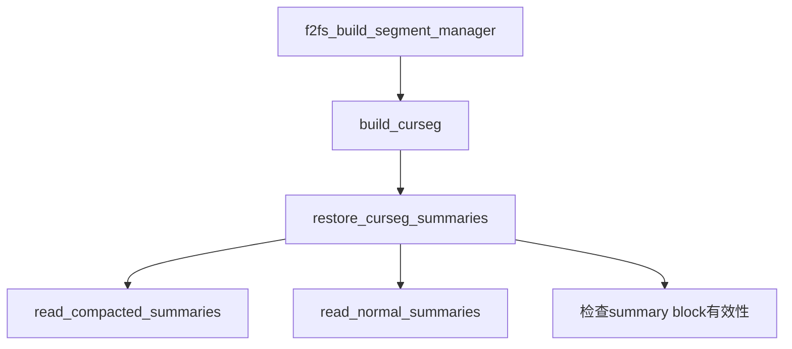


1. build_curseg

   这一步也属于后滚恢复部分，主要恢复curseg。

   ```c
   static int build_curseg(struct f2fs_sb_info *sbi)
   {
   	struct curseg_info *array;
   	int i;
   
   	array = f2fs_kzalloc(sbi, array_size(NR_CURSEG_TYPE, sizeof(*array)),
   			     GFP_KERNEL); // 根据active segment类型的数目分配空间
   	if (!array)
   		return -ENOMEM;
   
   	SM_I(sbi)->curseg_array = array; // 赋值到f2fs_sm_info->curseg_array
   
   	for (i = 0; i < NR_CURSEG_TYPE; i++) { // 为curseg的其他信息分配空间，初始化锁等
   		mutex_init(&array[i].curseg_mutex);
   		array[i].sum_blk = f2fs_kzalloc(sbi, PAGE_SIZE, GFP_KERNEL);
   		if (!array[i].sum_blk)
   			return -ENOMEM;
   		init_rwsem(&array[i].journal_rwsem);
   		array[i].journal = f2fs_kzalloc(sbi,
   				sizeof(struct f2fs_journal), GFP_KERNEL);
   		if (!array[i].journal)
   			return -ENOMEM;
   		array[i].segno = NULL_SEGNO;
   		array[i].next_blkoff = 0;
   	}
   	return restore_curseg_summaries(sbi); // 从f2fs_checkpoint恢复上一个CP点CURSEG的状态
   }
   ```

2. restore_curseg_summaries

   ​	第一步先检查CP_COMPACT_SUM_FLAG的标志，这个标志用于检查是否按COMPACTED的方式读取data summary。第二步就是通过NORMAL的方式读取NODE的summary。 

   ```c
   static int restore_curseg_summaries(struct f2fs_sb_info *sbi)
   {
   	struct f2fs_journal *sit_j = CURSEG_I(sbi, CURSEG_COLD_DATA)->journal;
   	struct f2fs_journal *nat_j = CURSEG_I(sbi, CURSEG_HOT_DATA)->journal;
   	int type = CURSEG_HOT_DATA;
   	int err;
   
   	if (is_set_ckpt_flags(sbi, CP_COMPACT_SUM_FLAG)) {
   		int npages = f2fs_npages_for_summary_flush(sbi, true); // 检查需要读取一个block还是2个block
   
   		if (npages >= 2)
   			f2fs_ra_meta_pages(sbi, start_sum_block(sbi), npages,
   							META_CP, true); // 先预读出来
   
   		/* restore for compacted data summary */
   		read_compacted_summaries(sbi); //恢复 compacted summary
   		type = CURSEG_HOT_NODE;
   	}
   
   	if (__exist_node_summaries(sbi)) // 如果没有出现宕机，则预测这几个block
   		f2fs_ra_meta_pages(sbi, sum_blk_addr(sbi, NR_CURSEG_TYPE, type),
   					NR_CURSEG_TYPE - type, META_CP, true);
   
   	/*
   	 * 如果没有COMPACTED标识，则DATA和NODE都使用NORMAL的方式进行恢复
   	 * */
   	for (; type <= CURSEG_COLD_NODE; type++) {
   		err = read_normal_summaries(sbi, type);
   		if (err)
   			return err;
   	}
   
   	/* sanity check for summary blocks */
   	if (nats_in_cursum(nat_j) > NAT_JOURNAL_ENTRIES ||
   			sits_in_cursum(sit_j) > SIT_JOURNAL_ENTRIES)
   		return -EINVAL;
   
   	return 0;
   }
   ```

   

3. read_compacted_summaries

   ​	F2FS设置了CP_COMPACT_SUM_FLAG。由于compacted mode和normal mode下，data部分布局是不同的，所以data curseg需要以compated mode的方式从checkpoint的Active Segments部分获取信息。详见[compacted summaries和normal summaries区别](#compacted summaries和normal summaries区别)。

4. read_normal_summaries

   ​	读取normal summary，做的事情和read_compacted_summaries()类似，只是由于布局不同，所以读取方式与compacted模式不太一样。

   ​	[详见袁学长笔记](https://github.com/RiweiPan/F2FS-NOTES/blob/master/F2FS-Data-Recovery/Recovery%E7%9A%84%E6%B5%81%E7%A8%8B.md)
   
   ​	注意，这个函数还包含了针对node summary的后滚恢复。因为node summary entry中只记录着parent nid，不像data summary那样还有ofs_in_node信息。因此对node的后滚恢复在这里做。
   
   ```c
   static int read_normal_summaries(struct f2fs_sb_info *sbi, int type)
   {
   	...
   	if (IS_NODESEG(type)) {
   		if (__exist_node_summaries(sbi)) {// 如果没有宕机的情况下，将每一个ns重新置为0
   			struct f2fs_summary *ns = &sum->entries[0];
   			int i;
   			for (i = 0; i < sbi->blocks_per_seg; i++, ns++) {
   				ns->version = 0;
   				ns->ofs_in_node = 0;
   			}
   		} else {
   			f2fs_restore_node_summary(sbi, segno, sum);// 如果出现了宕机，则执行这个这个函数
   		}
   	}
   	...
   }
   ```
   
   ​	f2fs_restore_node_summary 具体操作是把curent node segment上的所有node读取出来，从这些node page的footer中获取他们的parent nid信息并写入summary entry中。
   
   ```c
   
   void f2fs_restore_node_summary(struct f2fs_sb_info *sbi,
   			unsigned int segno, struct f2fs_summary_block *sum)
   {
   	struct f2fs_node *rn;
   	struct f2fs_summary *sum_entry;
   	block_t addr;
   	int i, idx, last_offset, nrpages;
   
   	/* scan the node segment */
   	last_offset = sbi->blocks_per_seg;
   	addr = START_BLOCK(sbi, segno);
   	sum_entry = &sum->entries[0];
   
   	for (i = 0; i < last_offset; i += nrpages, addr += nrpages) {
   		nrpages = min(last_offset - i, BIO_MAX_PAGES);
   
   		/* readahead node pages */
   		f2fs_ra_meta_pages(sbi, addr, nrpages, META_POR, true);
   
   		for (idx = addr; idx < addr + nrpages; idx++) {
   			struct page *page = f2fs_get_tmp_page(sbi, idx);
   
   			rn = F2FS_NODE(page);
   			sum_entry->nid = rn->footer.nid;
   			sum_entry->version = 0;
   			sum_entry->ofs_in_node = 0;
   			sum_entry++;
   			f2fs_put_page(page, 1);
   		}
   
   		invalidate_mapping_pages(META_MAPPING(sbi), addr,
   							addr + nrpages);
   	}
   }
   ```
   
   
   
5. 

### 涉及缓存page的函数

​	f2fs要从硬盘读取页数据时，先要调用f2fs_grab_cache_page创建page对象，再调用f2fs_submit_page_bio从硬盘中读取数据填充该页对象。

#### f2fs_get_meta_page（封装着f2fs_grab_cache_page

##### checkpoint.c

1. f2fs_recover_orphan_inodes
2. get_checkpoint_version
3. f2fs_get_valid_checkpoint

##### node.c

1. get_current_nat_page
   1. __f2fs_build_free_nids（父函数
2. get_next_nat_page
   1. __flush_nat_entry_set（父函数
3. f2fs_get_node_info
4. __get_nat_bitmaps

##### segment.c

1. f2fs_get_sum_page
2. read_compacted_summaries（两处
3. read_normal_summaries（两处

#### f2fs_grab_cache_page（最终封装着find_or_create_page

​	还有一下部分会调用f2fs_grab_cache_page来读取MAIN区域的数据。

##### checkpoint.c（可以看到这部分用的是META_MAPPING

1. f2fs_grab_meta_page
2. __get_meta_page
   1. f2fs_get_meta_page
   2. f2fs_get_tmp_page
3. f2fs_ra_meta_pages（预读META区域数据

##### data.c（这部分用的是inode->i_mapping或NODE_MAPPING

1. f2fs_get_read_data_page
2. f2fs_get_new_data_page
3. f2fs_xattr_fiemap（两处

##### gc.c

1. move_data_block

##### inline.c

1. f2fs_convert_inline_inode

##### node.c

1. f2fs_new_node_page
2. f2fs_ra_node_page
3. __get_node_page
   1. **f2fs_get_node_page**（父函数
   2. f2fs_get_node_page_ra（父函数
4. f2fs_recover_inode_page

#### f2fs_do_write_meta_page


#### 另附：f2fs_get_meta_page和f2fs_grab_meta_page的区别

​	这两个函数都是要调用f2fs_grab_cache_page来先在内存创建page对象。

​	f2fs_get_meta_page是要从硬盘中读取META区域的数据，因此当分配的page对象中的数据不是最新的时候，还要调用f2fs_submit_page_bio来提交bio请求。

​	f2fs_grab_meta_page是要更新META区域的数据，一般是page对象已经分配好，并且硬盘数据已经写入到内存中了。但是该page仍在等待写回队列中（page的writeback位为1），则会一直等待META区域的page写回为止，才会继续写入新的数据。

### 数据组织

[数据组织](https://github.com/RiweiPan/F2FS-NOTES/blob/master/Reading-and-Writing/file_data_structure.md)

​	注意，只有inode，direct node和indirect node有nid，并且nid = ino时表示该节点为inode节点。F2FS用物理地址指明数据页，而用nid来指明上面三种节点页的地址。下面两个是直接节点和间接节点的结构体，也显示了addr和nid的区别。

```c
struct direct_node {
	__le32 addr[ADDRS_PER_BLOCK]; // ADDRS_PER_BLOCK=1018
} __packed;

struct indirect_node {
	__le32 nid[NIDS_PER_BLOCK]; // NIDS_PER_BLOCK=1018
} __packed;
```


### 非第一次挂载，读取NVM超级块并设置nsbi

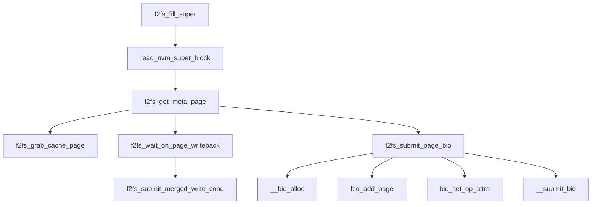

1.  **bio_add_page**

   包含\_\_bio_try_merge_page()和\_\_bio_add_page()两个函数。前一个用于尝试将段添加到bio->bio_vec最后一个元素上，算是一种优化。后一个如下：

   ```c
   /*
   	将一个段（页中的一部分，也可能是整个页）加入bio->bio_vec中
   */
   void __bio_add_page(struct bio *bio, struct page *page,
   		unsigned int len, unsigned int off)
   ```

2. **__submit_bio**

   如下

#### __submit_bio

​	文件系统与块设备交互的核心接口。

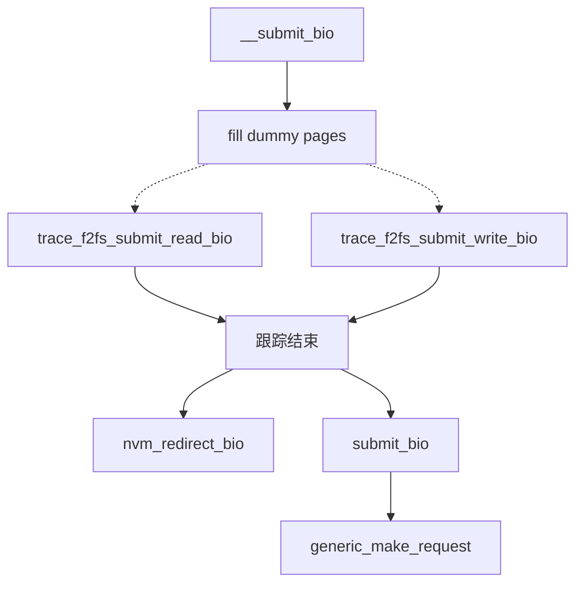

1. nvm_redirect_bio()

   这个函数用于bio重定向，即根据bio的类型来将需要进行IO的设备从SSD改为NVM。

   如果写入页是META类型（元数据）或META_FLUSH类型（元数据并且要等待前面的数据刷入），则以下两种情况需要重定向到NVM中：

   > ​    *//非第一次挂载，重定向到nvm设备中*
   >
   > ​    *//如果是第一次挂载，读不重定向，写重定向；*

   如果写入页是主数据区域，则需要到nsbi->mpt[index]中查看某个段的最新数据是否在NVM上，这个信息记录在mpt表项的redirect_flag上。注意：index是在SSD上的段偏移，mpt表项的值是NVM段偏移左移三位而得，这低三位表示如下：

   > \#define rw_map 1 *//段是否有映射；一旦映射被取消，段就要被回收了，所以取消映射时候所有标志位包括数值都要清除:clear_map*
   >
   > \#define rw_redirect 2 *//段读写是否重定向*
   >
   > \#define rw_double 4 *//段是否在双盘都有一份数据*

   主数据区的页如果需要重定向，则需要修改bio相应的读写地址bio->bi_iter.bi_sector。

   此外，重定向实际就是调用bio_set_dev()修改bio的设备，即将sbi->sb->s_bdev改为nsbi->nbdev。

2. **submit_bio**

   这个函数是块设备层提供的API，是对generic_make_request()的一个封装。

3.   **generic_make_request**

   这个函数就是和块设备的交互接口，负责向块设备提交io请求。它的请求结果消息（成功/失败、是否完成）都是异步的，并传给bio->bi_end_io函数处理，这个函数在__bio_alloc()中设置，读/写各有一个专门的函数。

   > f2fs_read_end_io
   >
   > f2fs_write_end_io

   可以看一下__bio_alloc()源码和调用例子

   ```c
   static struct bio *__bio_alloc(struct f2fs_sb_info *sbi, block_t blk_addr,
   							   struct writeback_control *wbc,
   							   int npages, bool is_read,
   							   enum page_type type, enum temp_type temp) {
   	struct bio *bio;
   
   	bio = f2fs_bio_alloc(sbi, npages, true);
   
   	f2fs_target_device(sbi, blk_addr, bio);
   	if (is_read) {
   		bio->bi_end_io = f2fs_read_end_io;
   		bio->bi_private = NULL;
   	} else {
   		bio->bi_end_io = f2fs_write_end_io;
   		bio->bi_private = sbi;
   		bio->bi_write_hint = f2fs_io_type_to_rw_hint(sbi, type, temp);
   	}
   	if (wbc)
   		wbc_init_bio(wbc, bio);
   
   	return bio;
   }
   //f2fs_submit_page_bio中的调用例子
   	bio = __bio_alloc(fio->sbi, fio->new_blkaddr, fio->io_wbc,
   					  1, is_read_io(fio->op), fio->type, fio->temp);
   //fio的成员如下
   	struct f2fs_io_info fio = {
   		.sbi = sbi,
   		.type = META,
   		.op = REQ_OP_READ,
   		.op_flags = REQ_META | REQ_PRIO,
   		.old_blkaddr = index,
   		.new_blkaddr = index,
   		.encrypted_page = NULL,
   		.is_meta = is_meta,
   	};
   ```

   

### F2FS的inode

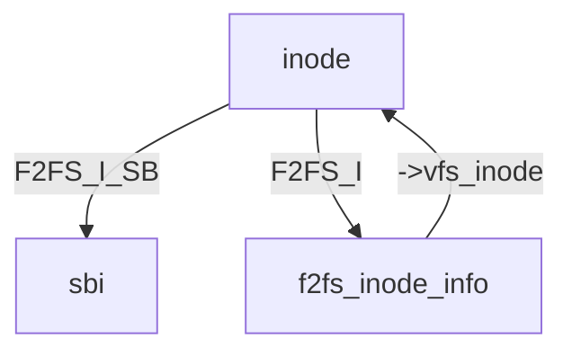


### 文件创建

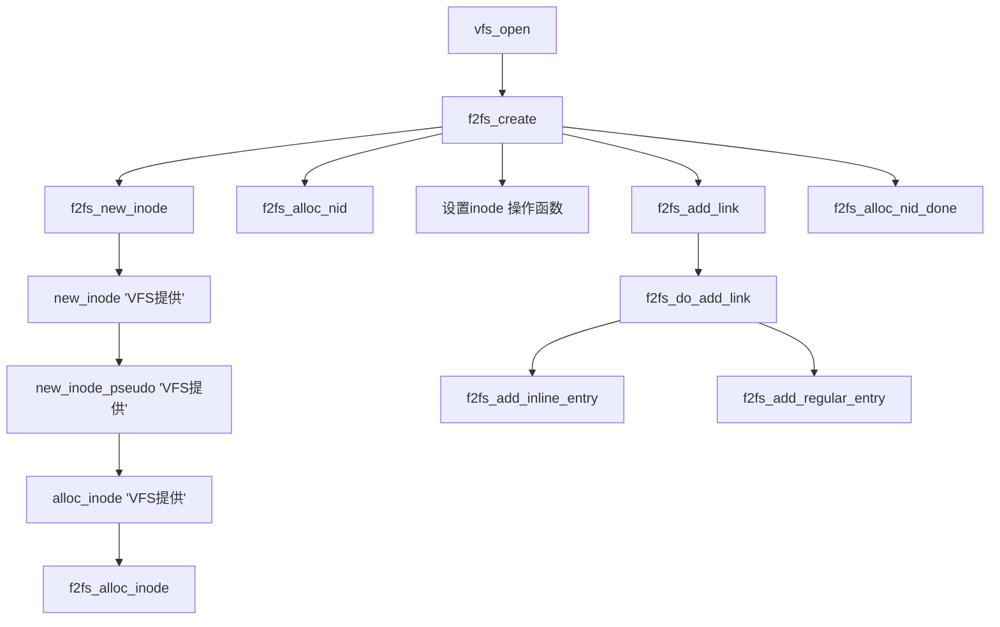

1. f2fs_dir_inode_operations.create = f2fs_creat(inode->i_op = f2fs_dir_inode_operations，在创建目录项时被设置，namei.c line 651)

   

2. f2fs_alloc_inode

   为inode创建f2fs专用的inode内存结构，并初始化相关的锁。

3. f2fs_alloc_nid

   从free_nid 缓存中分配一个free id。

4. 设置inode操作函数

   ​	主要设置以下三种类型操作集合

   >   inode->i_op = &f2fs_file_inode_operations; //查看和设置文件属性的两个操作函数
   >
   >   inode->i_fop = &f2fs_file_operations;//常规文件操作函数
   >
   >   inode->i_mapping->a_ops = &f2fs_dblock_aops;//块数据IO操作函数

5. sb->s_op->alloc_inode(sb) = f2fs_alloc_inode

   ​	这个函数在内存创建 f2fs_inode_info ，然后初始化一堆信号锁和链表头，接着将f2fs_inode_info->vfs_inode返回上层，现在**仍未分配数据块**给这个文件。

6. f2fs_add_inline_entry

   应该类似inode_inline_data那样，TODO

7. f2fs_add_regular_entry

   ```mermaid
   graph TD
   A[f2fs_add_regular_entry]
   B1[TODO:添加目录项并加入到父目录当中]
   B2[f2fs_init_inode_metadata]
   B2_temp(内部流程)
   B3[f2fs_update_dentry]
   B2.C1[f2fs_new_inode_page]
   B2.C2[f2fs_init_acl]
   B2.C3[f2fs_init_security]
   B2.C4[f2fs_get_node_page]
   D[init_dent_inode]
   F[f2fs_i_links_write]
   A	--> B1
   A	--> B2
   A	--> B3
   B2	--> B2_temp
   B2_temp	-->|新的inode| B2.C1
   B2_temp	-->|inode已存在| B2.C4
   B2.C1	--> B2.C2
   B2.C2	--> B2.C3
   B2.C3	--> D
   B2.C4	--> D
   D	--> F
   ```

   1. f2fs_init_inode_metadata

      创建inode page，初始化与父目录有关的信息

   2.  f2fs_update_dentry

      基于新inode的信息(名字，ino等)更新f2fs_dir_entry

   3. **f2fs_new_inode_page**

      为新分配的inode获取相应page。同时还包含了f2fs分配inode所要进行的管理操作。

      ```mermaid
      graph TD
      A[f2fs_new_inode_page]
      B[f2fs_new_node_page]
      C1[f2fs_grab_cache_page]
      C2[inc_valid_node_count]
      C3[填写node_info结构体信息]
      C4[f2fs_wait_on_page_writeback]
      C5[fill_node_footer]
      
      A	--> B
      B	--> C1
      B	--> C2
      B	--> C3
      B	--> C4
      B	--> C5
      ```

      

   4. init_dent_inode

      将新创建的inode page的名字写入对应的page cache。

   5. is_inode_flag_set

      再增加inode的引入链接

8. 


### 一个free nid分配流程

​	以文件创建为例

```c
		/*
		 *   Thread A             Thread B
		 *  - f2fs_create
		 *   - f2fs_new_inode
		 *    - f2fs_alloc_nid
		 *     - __insert_nid_to_list(PREALLOC_NID)
		 *                     - f2fs_balance_fs_bg
		 *                      - f2fs_build_free_nids
		 *                       - __f2fs_build_free_nids
		 *                        - scan_nat_page
		 *                         - add_free_nid
		 *                          - __lookup_nat_cache
		 *  - f2fs_add_link
		 *   - f2fs_init_inode_metadata
		 *    - f2fs_new_inode_page
		 *     - f2fs_new_node_page
		 *      - set_node_addr
		 *  - f2fs_alloc_nid_done
		 *   - __remove_nid_from_list(PREALLOC_NID)
		 *                         - __insert_nid_to_list(FREE_NID)
		 */
```

​	add_free_nid() 只是分配扫描过的nat entry的nid，在 set_node_addr() 中才确定node 的物理地址并写入nat entry。f2fs_new_node_page创建了新的nat entry，设置了blk_addr = NULL_ADDR，并通过set_node_addr将blk_addr设置成NEW_ADDR。调用do_write_page和write_node_page回写块数据时，才会挑一个具体的blkaddr赋值给NEW_ADDR的nat entry。

### f2fs写入node，并设置nat entry中的地址

​	主要函数是__write_node_page，调用这个函数的有，f2fs_sync_node_pages，f2fs_move_node_page，f2fs_write_node_page和f2fs_fsync_node_pages。

​	__write_node_page到最后也是调用do_write_page。然后在do_write_page中调用f2fs_allocate_data_block，来分配一个新的node块地址。

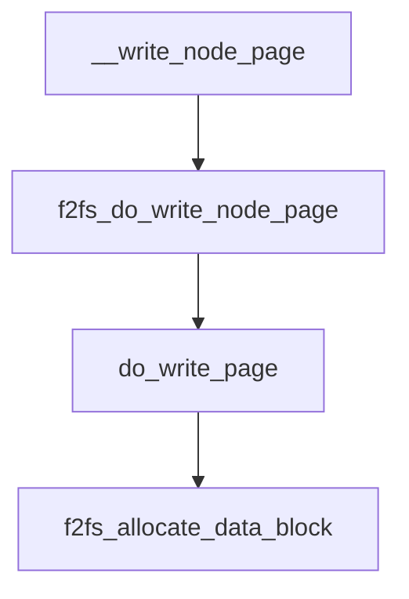

​	在写记录点函数中的block_operations中使用了f2fs_sync_node_pages。

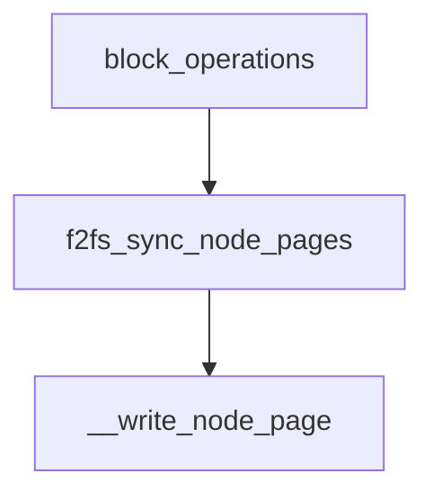


### f2fs如何切换curseg

​	函数调用情况，

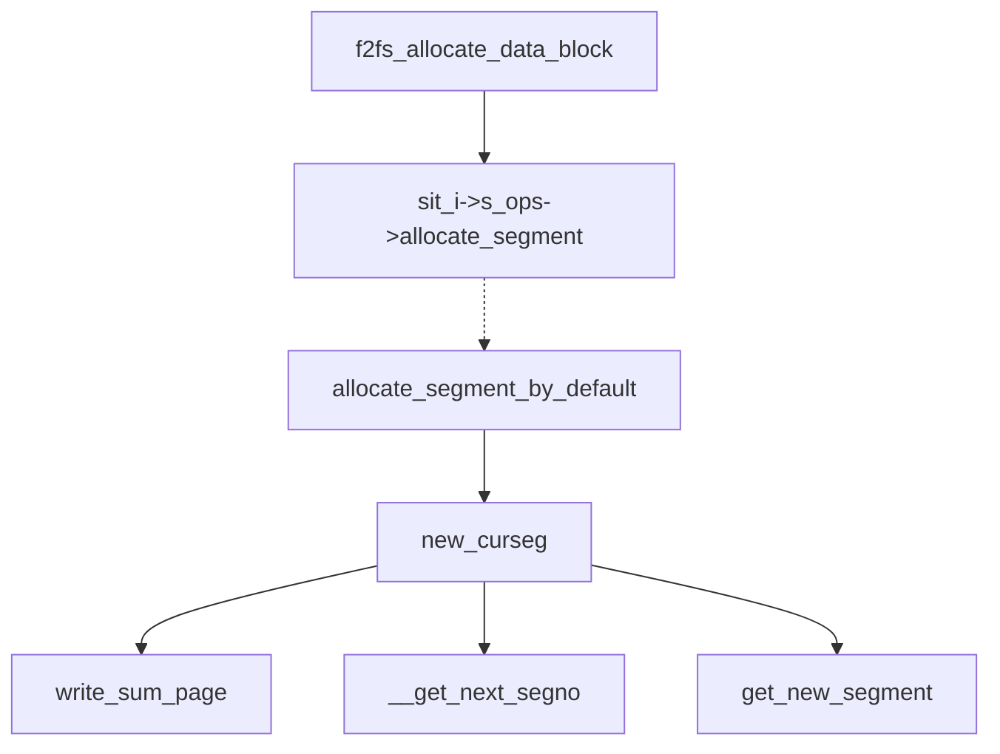

​	在f2fs_allocate_data_block中，如果当前segment没有多余空间可以分配，则需要切换curseg，代码如下，

```c
	//如果当前seg没有空间，重新分配一个新的（allocate_segment_by_default）
	if (!__has_curseg_space(sbi, type))
		sit_i->s_ops->allocate_segment(sbi, type, false);
```

​	其中 sit_i->s_ops->allocate_segment 即 allocate_segment_by_default。

```c
static void allocate_segment_by_default(struct f2fs_sb_info *sbi,
						int type, bool force)
{
	struct curseg_info *curseg = CURSEG_I(sbi, type);

	if (force)
		new_curseg(sbi, type, true);
	else if (!is_set_ckpt_flags(sbi, CP_CRC_RECOVERY_FLAG) &&
					type == CURSEG_WARM_NODE)
		new_curseg(sbi, type, false);
	else if (curseg->alloc_type == LFS && is_next_segment_free(sbi, type))
		new_curseg(sbi, type, false);//常规情况下，是走这一步
	else if (f2fs_need_SSR(sbi) && get_ssr_segment(sbi, type))
		change_curseg(sbi, type);
	else
		new_curseg(sbi, type, false);

	stat_inc_seg_type(sbi, curseg);
}
```

​	new_curseg有些复杂，其中最简单的找下一个curseg的方法是从free_i->free_segmap里找下一个空闲段。

### 文件读取


1.  mapping->a_ops->readpage = f2fs_read_data_page() （mapping->a_ops 在data.c中设置）。无论是读单个页的 f2fs_read_data_page 还是多个页的 f2fs_read_data_pages 都是调用 f2fs_mpage_readpages() ，只是传入参数不同。

   ```mermaid
   graph TD
   A[f2fs_read_data_page ]
   B1[f2fs_read_inline_data]
   B2[f2fs_mpage_readpages]
   A	-->|有inline_data| B1
   A	-->|无inline_data| B2
   
   ```

   

2. f2fs_mpage_readpages

   [参考袁学长笔记，但是有部分在Hybrid F2FS中稍作修改（data.c line 1457）](https://github.com/RiweiPan/F2FS-NOTES/blob/master/Reading-and-Writing/%E8%AF%BB%E6%B5%81%E7%A8%8B.md)

   > 1. 遍历传入的page，得到每一个page的index以及inode
   > 2. 将page的inode以及index传入 `f2fs_map_blocks` 函数获取到该page的物理地址
   > 3. 分配一个bio，并将page添加到bio上，直到加满bio或者所有的连续page（即下一个page与上一个page不连续时就需要提交bio了）都加入到了bio
   > 4. 将物理地址通过 `submit_bio` 读取该page在磁盘中的数据

3. generic_file_buffered_read

   这个函数会按page为单位将数据复制到用户态。这个函数有两种退出条件，一是读取数据量达到用户需要的数据量，即iov_iter_count(iter)；二是读取的数据达到文件size（如cat命令读取所有文件数据）。

4. 

### 文件写入

[详见：袁学长笔记，f2fs_write_data_pages函数]( https//github.com/RiweiPan/F2FS-NOTES/blob/master/Reading-and-Writing/%E5%86%99%E6%B5%81%E7%A8%8B.md%20 )

重点：do_write_page

#### 写数据

​	这里重点看写数据时，分配segment中空闲块的过程。

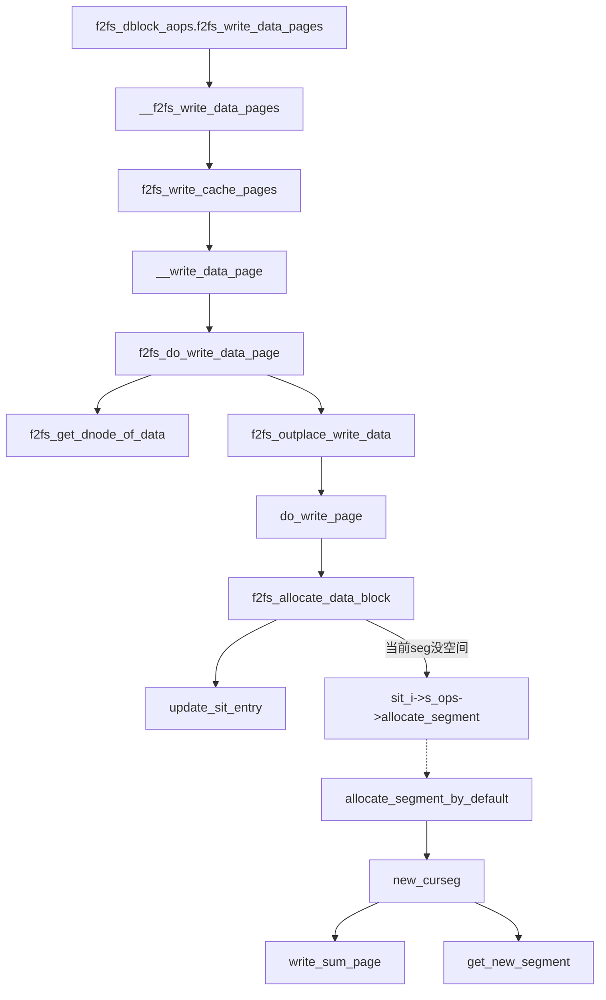

1. new_curseg

   有写入SSA的操作，即write_sum_page

2. __write_data_page

   在这一层创建fio。

3. f2fs_submit_page_write

   每个类型的数据都有一个 f2fs_bio_info 结构体，依次提交bio数据。

   fio->temp

4. 

#### f2fs_write_begin和f2fs_write_end函数

 	VFS中`write_begin`和`write_end`函数分别是数据写入page cache前以及写入后的处理。写入page cache后，系统会维护一段时间，直到满足一定条件后(如fsync和writeback会写)，VFS会调用writepages函数，将这些缓存在内存中的page一次性写入到磁盘中。`write_begin`和`write_end`函数的调用可以参考VFS的`generic_perform_write`函数。

​	 `write_begin`在F2FS中对应的是`f2fs_write_begin`，它的作用是将根据用户需要写入的数据类型，对page进行初始化。如果是追加写（addr == NEW_ADDR），则初始化page中数据为0。如果是覆盖写，则需要到SSD读取原始数据。


#### 同步写

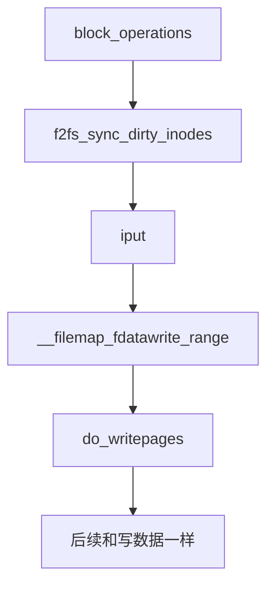


### radix_tree使用方法

```c
/*声明与初始化*/
struct radix_tree_root my_tree;
INIT_RADIX_TREE(my_tree, gfp_mask);
INIT_RADIX_TREE(&rm_i->warm_file_root, GFP_NOIO);
/* 插入条目 */
int radix_tree_insert(struct radix_tree_root *root, unsigned long index, void *item);
//尝试预分配
int radix_tree_preload(gfp_t gfp_mask);
radix_tree_preload(GFP_NOFS | __GFP_NOFAIL);
void radix_tree_preload_end(void);
radix_tree_preload_end();
/* 删除条目，返回被删除条目的指针 */
void *radix_tree_delete(struct radix_tree_root *root, unsigned long index);
/* 查询条目 */
//单值查找
void *radix_tree_lookup(struct radix_tree_root *root, unsigned long index);
//多值查找
radix_tree_gang_lookup(struct radix_tree_root *root, void **results, unsigned long first_index, unsigned int max_items);
```

### list使用方法

```c
/* 初始化 */
INIT_LIST_HEAD(&warm_file->range_list_head);
/* 添加到一个链表节点之后 */
list_add(&entry->record_entry_list, &temp_entry->record_entry_list);
/* 添加到尾部 */
list_add_tail(&entry->record_entry_list, &set->record_entry_list_head);
/* 判断是否为空 */
list_empty(&set->record_entry_list_head)
/* 删除 */
list_del(&entry->record_entry_list);
/* 遍历 */
struct list_head *pos/* 链表节点指针 */;
list_for_each(pos, &set->record_entry_list_head){
    // ...
}
/* 从链表节点指针获取整个结构体 */
list_entry(pos, struct record_entry, record_entry_list);
```

### Hlist使用方法

定义在include/linux/list.h

详见博客[ **哈希链表结构 hlist 介绍与用例** ](https://blog.51cto.com/u_15352922/3745233)

```c
/* 链表头 */
struct hlist_head {
	struct hlist_node *first;
};

/* 链表结点，具体的数据结构体只需要包含这个结构体就可以了 */
struct hlist_node {
	struct hlist_node *next, **pprev;
}; 
//hlist_head 初始化
#define INIT_HLIST_HEAD(ptr) ((ptr)->first = NULL) //动态初始化
//hlist_node 初始化
static inline void INIT_HLIST_NODE(struct hlist_node *h)
{
	h->next = NULL;
	h->pprev = NULL;
}
//删除前有判断
static inline void hlist_del_init(struct hlist_node *n);
//判断链表头是否为空，是的话返回1
static inline int hlist_empty(const struct hlist_head *h);
    
//遍历结点
hlist_for_each(pos, head) 
//遍历结点过程中有删除结点操作使用这个接口
hlist_for_each_safe(pos, n, head) 
//使用方法，先创建数组，在添加节点
struct hlist_head htable[MAX_ADDR];
struct hdata_node *hnode = NULL;
```


### slab分配器

```c
/* 分配 */
set = f2fs_kmem_cache_alloc(update_set_slab, GFP_F2FS_ZERO);
/* 释放 */
kmem_cache_free(update_set_slab, set);
```


### 各种锁的用法

```c
/* 1. mutex：用于做一个大事件 */
//初始化
mutex_init(&nm_i->build_lock);
//加锁
if (!mutex_trylock(&nm_i->build_lock))
    return 0;
//解锁
mutex_unlock(&nm_i->build_lock);
//删除锁
/* 2. spin_lock：锁链表 */
//初始化
spin_lock_init(&nm_i->nid_list_lock);
//加锁
spin_lock(&nm_i->nid_list_lock);
//解锁
spin_unlock(&nm_i->nid_list_lock);
//删除锁
/* 3. rw_semaphore：锁 radix tree */
//初始化
//加锁
down_read(&nm_i->nat_tree_lock);
down_write(&nm_i->nat_tree_lock);
//解锁
up_read(&nm_i->nat_tree_lock);
up_write(&nm_i->nat_tree_lock);
//删除锁
```


### 设备数据分布

SSD：super block -->META(checkpoint-->SIT-->NAT-->SSA)-->MAIN

NVM：super block -->META-->MPT(映射表)-->MAIN

NVM super block的尾部跟着*mpt_ver_map*（MPT有效块在第一或二个segment中）*和 *segment_map*（NVM的main区域segment有效性位图）。

此外，还在内存保存*MPT版本位图*、*main区域segment位图*、*MPT表脏页位图*、*MPT cache*（大小为mpt_entries数量）和 *lfu_count cache*。


### 一些函数

1. read_meta_page_from_SSD

   将页缓存到内存中，涉及address_space和page结构体的操作。

2. get_node_path

   参数：(**struct** inode \*inode, **long** block,**int** offset[4], **unsigned** **int** noffset[4])

   被f2fs_get_dnode_of_data()调用，根据文件inode和逻辑块偏移block确定该块的物理位置。

   [函数过程分析博客](https://blog.csdn.net/tianweishuiguo/article/details/102084921)

   注意f2fs的inode结构如下

   ```
     4KB * (923 + 2 * 1018 + 2 * 1018 * 1018 + 1018 * 1018 * 1018) := 3.94TB.
   
      Inode block (4KB)
        |- data (923)
        |- direct node (2)
        |          `- data (1018)
        |- indirect node (2)
        |            `- direct node (1018)
        |                       `- data (1018)
        `- double indirect node (1)
                            `- indirect node (1018)
                             `- direct node (1018)
                                                `- data (1018)
   
   ```

   f2fs node有三种类型，inode, direct node和indirect node. inode block为4KB, 除去一些文件相关的meta data, 最多预留923个data block索引，2个direct node 索引，2个indirect node索引和一个double indirect node索引。

3.  **struct** page *****f2fs_grab_meta_page(**struct** f2fs_sb_info *****sbi, **unsigned** **long** index) 

   是f2fs给的获取page的API，注意这里虽然传入的是SSD的sbi，但是下层进行IO时，会根据需要选择NVM还是SSD进行IO。*补充：好像只是分配页描述符，数据在__submit_bio中才从设备传上来*
   
4. f2fs_wait_on_page_writeback

   等待某个页面写入完毕。即，当需要对一个page进行修改时，如果在此之前，该page正在队列中等待回写。则后续对该page的更新就需要等前面的回写操作完成之后才开始。

5. 

### Hybrid F2FS传入设备位置

​	挂载时传输整个字符串参数会保存在char* options里，通过strsep()获取每一个参数和值，如”*background_gc=2*“。在通过match_token匹配预设的参数，最后返回参数的值,保存在substring_t args中。

### F2FS各个单位数量关系

1. sector

   1 sector = 512B

   8 sector = 1 block

2. block

   F2FS_BLKSIZE = PAGE_SIZE = log_blocksize = 4KB

   log_blocks_per_seg * log_sectorsize = log_blocksize = 4KB

3. segment

   1 segment = 512 blocks

   F2FS_MAX_SEGMENT = 16 \* 1024 \* 1024 / 2，F2FS最大支持16TB，segment_size = 512 * 4KB = 2MB

   F2FS_MIN_SEGMENTS = 9，SB + 2 (CP + SIT + NAT) + SSA + MAIN

4. section

   数量关系未知

5. zone

   数量关系未知


## 其他关于Linux内核的知识

1. le32_to_cpu

   大小端转换

2. 页描述符是struct page结构体

   mapping字段是文件的address_space对象（每个文件都有一个address_space），index是这个页在文件中对应的位置。所有的页描述符都存放在mem_map数组中。涉及page的操作实际上都是在对页描述符操作，而非页里的数据操作。
   
3. address_space对象，详见[深入理解linux内核(PDF 614页)](E:\a_课程文件\毕设\我的文档\深入理解linux内核中文第三版(jb51.net).pdf)

4. 块缓冲区首部是struct buffer_head

   Linux设想块的大小有可能小于页的大小（4KB），即一页会有多个块，所以有一个list_head链表连接相邻块。缓冲区是具体数据存放位置。

   

5. 数据缓存页典型构造

   

6. 根据上述2、3点，可以通过地址空间对象address_space和逻辑块偏移offset，先在address_space中的基树中找到page结构，然后page->private指向相应的buffer_header缓冲区头结构，最后buffer_header->b_data才是具体信息。

7. find_or_create_page（用f2fs_grab_cache_page读取页时调用）在mapping中搜索或创建需要的页描述符，但还没有加载数据到页中。[深入理解linux内核(PDF 612页)](E:\a_课程文件\毕设\我的文档\深入理解linux内核中文第三版(jb51.net).pdf)

8. 提交bio请求

   

9. 

   ```c
   //申请内存,devm_kzalloc()函数自动释放内存
   devm_kzalloc(dev, sizeof(struct stu), GFP_KERNEL);
   GFP_KERNEL的作用
   GFP_KERNEL是linux内存分配器的标志，标识着内存分配器将要采取的行为。
   分配器标志分为行为修饰符，区修饰符及类型。行为修饰符表示内核应当如何分配所需的内存。
   区修饰符表示内存区应当从何处分配。类型就是行为修饰符和区修饰符的合体。
   
   在include/linux/gfp.h中定义,GFP_KERNEL是内核内存分配时最常用的，无内存可用时可引起休眠.
   #define GFP_KERNEL(__GFP_WAIT | __GFP_IO | __GFP_FS)
   
   __GFP_WAIT ： 缺内存页的时候可以睡眠;
   __GFP_IO ： 允许启动磁盘IO；
   
   __GFP_FS ： 允许启动文件系统IO。
   
   ```

### 遇到的问题

1. 提交一次写入的流程是什么样的。每次写入一个page都没有指定设备，下层是怎么判断使用哪个设备的？

   ​	写入流程里，小于一个块的数据量。f2fs_preallocate_blocks()里的f2fs_map_blocks()直接返回。也就是说，写入流程全用常规的API：__generic_file_write_iter()

   ​	解答：这个API在下层利用到了__submit_bio()，这部分是自己的代码。

2. checkpoint部分管理暂时放一放

3. 


